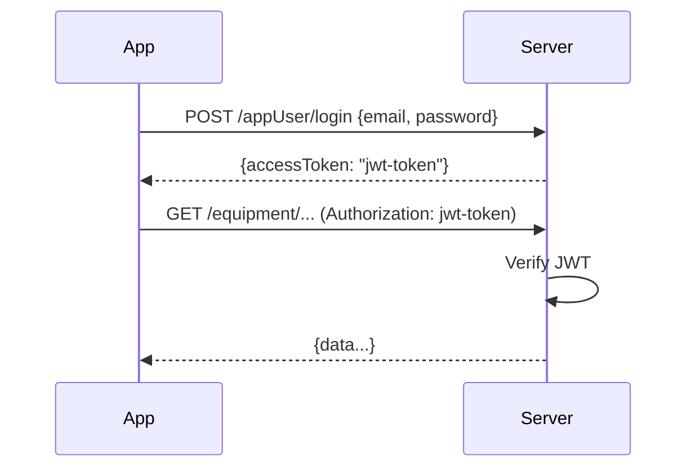

# Authentication

## Local Server Authentication

### JWT Tokens

The local server uses JWT tokens for app authentication.

Login returns a JWT `accessToken` which is sent in the `Authorization` header of subsequent requests.

### Password Encryption

The app encrypts passwords with AES-128-CBC before sending.

!!! lock "Private section"
    This section contains sensitive security details (encryption keys, credentials,
    vulnerability specifics) and is only available in the private wiki.

---

## Cloud API Authentication (Reverse-Engineered)

The real cloud uses a more complex signature scheme:

!!! lock "Private section"
    This section contains sensitive security details (encryption keys, credentials,
    vulnerability specifics) and is only available in the private wiki.

!!! lock "Private section"
    This section contains sensitive security details (encryption keys, credentials,
    vulnerability specifics) and is only available in the private wiki.

### Cloud Backend

- Spring Boot microservices behind nginx + Spring Cloud Gateway
- 5 services: `nova-user`, `nova-data`, `nova-file-server`, `novabot-message`, `nova-network`
- Swagger not deployed (404), Spring Boot Actuator blocked by nginx (403)

---

## MQTT Authentication

### Devices

| Device | Username | Password | Client ID |
|--------|----------|----------|-----------|
| Charger | `LFIC1230700XXX` | _(none in fw v0.3.6)_ | `ESP32_XXXXXX` |
| Mower | `LFIN2230700XXX` | _(unknown)_ | `LFIN2230700XXX_6688` |

!!! info "Local broker accepts all credentials"
    Our Aedes broker accepts any username/password. The charger firmware v0.3.6 does not send MQTT credentials at all.

### Cloud MQTT Credentials

Returned by `getEquipmentBySN` / `userEquipmentList`:

!!! lock "Private section"
    This section contains sensitive security details (encryption keys, credentials,
    vulnerability specifics) and is only available in the private wiki.

The charger gets MQTT credentials from the cloud; the mower does **not**.

### App MQTT CONNECT Bug

The Novabot app sends an MQTT CONNECT packet with **Will QoS=1** while **Will Flag=0**.
This violates MQTT 3.1.1 spec section 3.1.2.6.

**Fix**: `sanitizeConnectFlags()` in `broker.ts` patches the raw TCP bytes before Aedes parses them.
