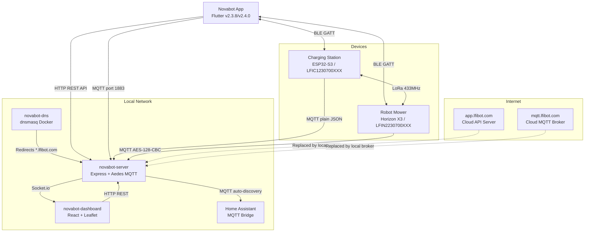
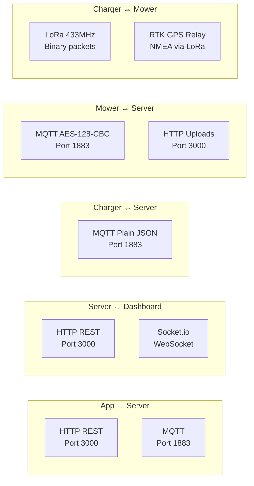

# Architecture Overview

## System Diagram

## Communication Layers

## Technology Stack

### Server (`novabot-server/`)

| Layer | Technology |
|-------|-----------|
| Runtime | Node.js + TypeScript (ESM modules) |
| HTTP | Express.js |
| MQTT Broker | Aedes (port 1883) |
| WebSocket | Socket.io |
| Database | better-sqlite3 (WAL mode) |
| Auth | JWT (jsonwebtoken + bcrypt) |

### Dashboard (`novabot-dashboard/`)

| Layer | Technology |
|-------|-----------|
| Framework | React 18 + TypeScript |
| Build tool | Vite |
| Styling | Tailwind CSS |
| Maps | Leaflet + PDOK aerial imagery |
| Real-time | Socket.io client |

### DNS (`novabot-dns/`)

| Layer | Technology |
|-------|-----------|
| Container | Alpine Linux (~8MB image) |
| DNS | dnsmasq |
| Purpose | Redirect `*.lfibot.com` → local server IP |

## Database Schema

| Table | Purpose |
|-------|---------|
| `users` | User accounts (email, bcrypt password, machine_token) |
| `email_codes` | Temporary verification codes |
| `equipment` | Bound devices (mower_sn PK, charger_sn, mac_address) |
| `device_registry` | Auto-learned via MQTT CONNECT (sn, mac, last_seen) |
| `maps` | Map metadata (polygons stored as JSON) |
| `map_uploads` | Fragmented map upload tracking |
| `cut_grass_plans` | Mowing schedules per device |
| `robot_messages` | Device → user messages |
| `work_records` | Mowing session history |
| `equipment_lora_cache` | Cached LoRa parameters (survives unbind) |
| `ota_versions` | OTA firmware versions |
| `map_calibration` | Manual map offset/rotation/scale per mower |
| `dashboard_schedules` | Dashboard mowing schedules (CRUD + MQTT push) |
