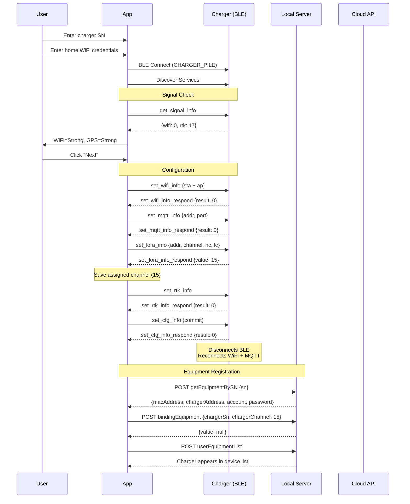

# Charger Provisioning Flow

## Prerequisites

- Charger powered on (DC24-30V)
- Charger NOT connected to WiFi/MQTT (must be in provisioning mode)
- Phone Bluetooth enabled
- Charger serial number known (e.g., `LFIC1230700XXX`)

## BLE Device

| Property | Value |
|----------|-------|
| BLE Name | `CHARGER_PILE` |
| BLE MAC | `48:27:E2:1B:A4:0A` |
| Service UUID | `0x1234` |
| Command Characteristic | `0x2222` |

## Step-by-Step Flow

## BLE Command Sequence

| Step | Command | Key Data |
|------|---------|----------|
| 1 | `get_signal_info` | Check WiFi + GPS quality |
| 2 | `set_wifi_info` | `sta` (home WiFi) + `ap` (charger AP, passwd=12345678) |
| 3 | `set_mqtt_info` | `addr`: mqtt.lfibot.com, `port`: 1883 |
| 4 | `set_lora_info` | `addr`: 718, `channel`: 16, `hc`: 20, `lc`: 14 |
| 5 | `set_rtk_info` | RTK GPS configuration |
| 6 | `set_cfg_info` | Commit all settings (value: 1) |

## After Provisioning

Once `set_cfg_info` is sent:

1. Charger disconnects from BLE
2. Charger connects to home WiFi (STA mode)
3. Charger connects to MQTT broker on port 1883
4. Charger starts publishing `up_status_info` every ~2 seconds
5. `charger_status` changes from 0 to operational values
6. `mower_error` counter starts incrementing (charger looking for mower via LoRa)

## Troubleshooting

| Symptom | Cause | Fix |
|---------|-------|-----|
| "Network configuration error. Please retry." | `set_wifi_info` or `set_mqtt_info` returned error | Check WiFi credentials, check MQTT broker reachable |
| "Network configuration error. Please ensure antenna..." | `set_lora_info` or `set_rtk_info` error | Check antenna connection |
| Charger not appearing in device list | `getEquipmentBySN` returns wrong data | Verify MAC address in device_registry matches BLE MAC |
| App can't find CHARGER_PILE | Charger already in operational mode | Power cycle charger to enter provisioning mode |
