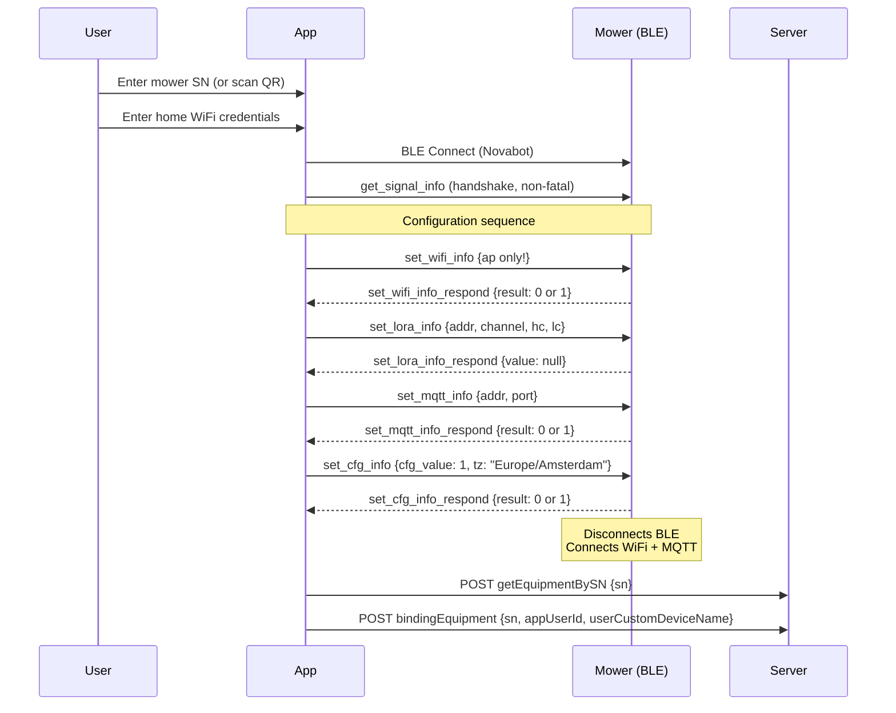

# Mower Provisioning Flow

!!! success "Fully Working (March 2026)"
    BLE provisioning for the mower has been confirmed working end-to-end using both the official Novabot app and the bootstrap wizard's native BLE (`@stoprocent/noble`). The mower connects to WiFi and MQTT without requiring a restart.

## Key Differences from Charger

| Aspect | Charger | Mower |
|--------|---------|-------|
| BLE name | `CHARGER_PILE` | `Novabot` / `NOVABOT` |
| BLE GATT service | `0x1234` | `0x0201` |
| Write characteristic | `0x2222` | `0x0011` |
| Notify characteristic | `0x2222` (same) | `0x0021` (different --- but responses come on `0x0011`!) |
| `set_wifi_info` | `sta` + `ap` | **Only `ap`** |
| `set_rtk_info` | Yes | **No** |
| `set_cfg_info` | `1` | `{"cfg_value":1,"tz":"Europe/Amsterdam"}` |
| `set_lora_info_respond` | Channel number (e.g., 15) | `null` |
| Command order | wifi -> mqtt -> lora -> rtk -> cfg | wifi -> lora -> mqtt -> cfg |

!!! warning "`result:1` does NOT mean rejected"
    Both `result:0` and `result:1` mean "acknowledged/applied". This was proven: `set_wifi_info` returned `result:1` but the WiFi password was successfully changed. All BLE commands work regardless of result value.

## Prerequisites

- Charger already provisioned and online
- Mower powered on and in provisioning mode
- Mower serial number known (e.g., `LFIN2230700XXX`)

## Step-by-Step Flow



## BLE Command Payloads

### set_wifi_info (Mower --- AP only)

```json
{
  "set_wifi_info": {
    "ap": {
      "ssid": "HomeNetwork",
      "passwd": "wifi-password",
      "encrypt": 0
    }
  }
}
```

!!! warning "No `sta` sub-object"
    Unlike the charger, the mower does NOT receive a `sta` WiFi configuration. The mower connects directly to the home network via the `ap` credentials.

### set_lora_info

```json
{"set_lora_info":{"addr":718,"channel":15,"hc":20,"lc":14}}
```

Response: `{"type":"set_lora_info_respond","message":{"value":null}}`

### set_mqtt_info

```json
{"set_mqtt_info":{"addr":"<server-ip>","port":1883}}
```

Response: `{"type":"set_mqtt_info_respond","message":{"result":0}}`

!!! info "MQTT redirect via BLE"
    `set_mqtt_info` modifies the mower's `json_config.json` directly. This is how the mower is pointed to the local server instead of `mqtt.lfibot.com`.

### set_cfg_info (with timezone)

```json
{"set_cfg_info":{"cfg_value":1,"tz":"Europe/Amsterdam"}}
```

!!! note "`tz` in BLE set_cfg_info is SAFE"
    The `tz` field in BLE `set_cfg_info` writes to `json_config.json` via the BLE handler. This is a completely different code path from the MQTT `ota_upgrade_cmd` timezone bug. BLE timezone is safe.

## BLE Frame Protocol

| Property | Value |
|----------|-------|
| Company ID | `0x5566` (in manufacturer data) |
| Frame start | `ble_start` string |
| Frame end | `ble_end` string |
| Chunk size | 20 bytes |
| Chunk delay | 30ms between chunks |
| Payload | JSON, split into 20-byte chunks |

!!! tip "Response filtering"
    Use an `expectedType` parameter when waiting for responses. The mower may send stale responses from previous commands. Filter by the expected response type (e.g., `set_wifi_info_respond`).

!!! warning "Char 0x0021 binary data"
    The mower's notify characteristic (`0x0021`) continuously sends binary data (hex `6262...6363...`). These are NOT BLE frame responses --- ignore them. Actual responses come on the write characteristic (`0x0011`).

## Server-Side Requirements

For BLE provisioning to work with the local server, these server responses are critical:

| Endpoint | Critical Detail |
|----------|----------------|
| `getEquipmentBySN` | `userId: 0` for unbound devices (not a number) -> triggers BLE provisioning in app |
| `getEquipmentBySN` | `chargerAddress: null, chargerChannel: null` for mower (ALWAYS) |
| `bindingEquipment` | Body: only `sn`, `appUserId`, `userCustomDeviceName` --- no LoRa fields |
| `saveCutGrassRecord` | Must return `ok(null)` on empty/unparseable body (mower sends multipart) |

### skipBle Logic

The server uses `skipBle` to prevent BLE overwrite of an already-online mower:

- **Online mower** -> `macAddress: null` in response -> app skips BLE
- **Offline mower** -> `macAddress: "<ble-mac>"` -> app starts BLE provisioning

### Recovery

If the mower gets stuck in BLE provisioning mode:

1. Turn OFF charging station
2. Turn OFF mower
3. Turn ON charging station, wait 30 seconds
4. Turn ON mower
5. Connection restores automatically
