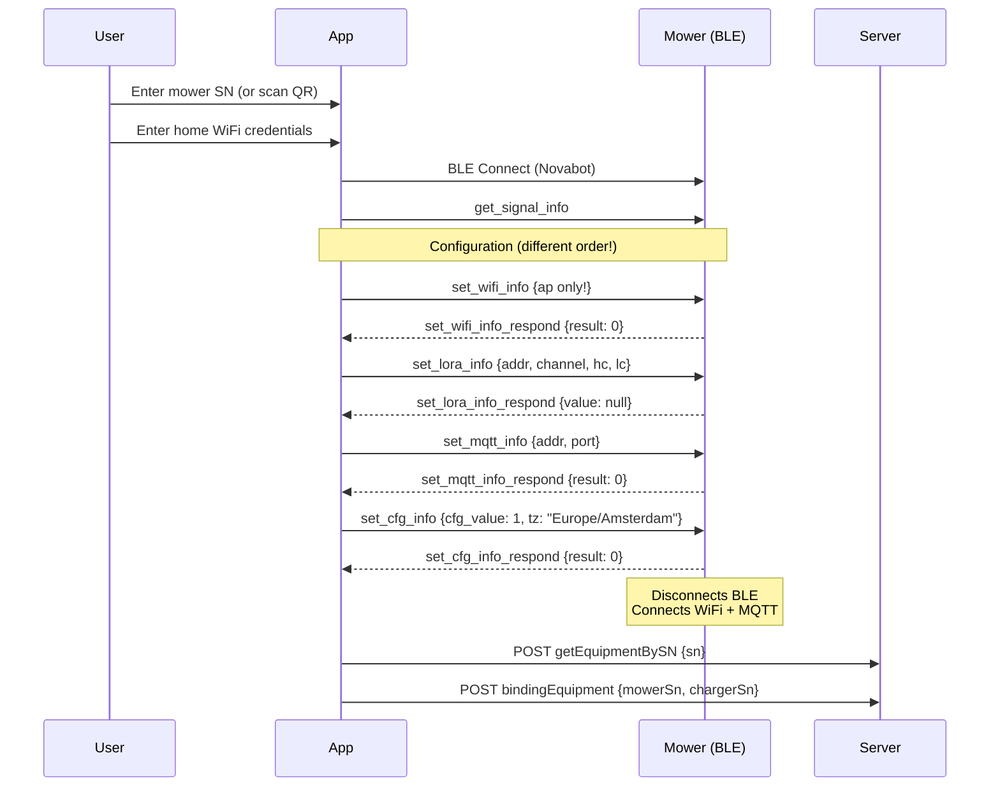

# Mower Provisioning Flow

## Key Differences from Charger

| Aspect | Charger | Mower |
|--------|---------|-------|
| BLE name | `CHARGER_PILE` | `Novabot` / `NOVABOT` |
| `set_wifi_info` | `sta` + `ap` | **Only `ap`** |
| `set_rtk_info` | Yes | **No** |
| `set_cfg_info` | `1` | `{"cfg_value":1,"tz":"Europe/Amsterdam"}` |
| `set_lora_info_respond` | Channel number (e.g., 15) | `null` |
| Command order | wifi → mqtt → lora → rtk → cfg | wifi → lora → mqtt → cfg |

## Prerequisites

- Charger already provisioned and online
- Mower powered on and in provisioning mode
- Mower serial number known (e.g., `LFIN2230700XXX`)

## Step-by-Step Flow



## BLE Command Payloads

### set_wifi_info (Mower — AP only)

```json
{
  "set_wifi_info": {
    "ap": {
      "ssid": "HomeNetwork",
      "passwd": "wifi-password",
      "encrypt": 0
    }
  }
}
```

!!! warning "No `sta` sub-object"
    Unlike the charger, the mower does NOT receive a `sta` WiFi configuration. The mower connects via the charger's AP or directly to the home network via the `ap` credentials.

### set_lora_info

```json
{"set_lora_info":{"addr":718,"channel":15,"hc":20,"lc":14}}
```

Response: `{"type":"set_lora_info_respond","message":{"value":null}}`

### set_cfg_info (with timezone)

```json
{"set_cfg_info":{"cfg_value":1,"tz":"Europe/Amsterdam"}}
```

## Mower-Specific Cloud Response

When `getEquipmentBySN` is called for a mower, several fields are `null`:

```json
{
  "equipmentId": 756,
  "deviceType": "mower",
  "sn": "LFIN2230700XXX",
  "macAddress": "50:41:1C:39:BD:C1",
  "chargerAddress": null,
  "chargerChannel": null,
  "account": null,
  "password": null
}
```

## Workaround: Manual Binding

If BLE provisioning fails (e.g., mower already on WiFi/MQTT):

```sql
-- Find user ID
SELECT app_user_id, email FROM users;

-- Verify mower is visible via MQTT
SELECT * FROM device_registry WHERE sn = 'LFIN2230700XXX';

-- Manually bind
INSERT INTO equipment (
  equipment_id, user_id, mower_sn, charger_sn,
  equipment_nick_name, equipment_type_h,
  charger_address, charger_channel, mac_address
) VALUES (
  '<uuid>', '<app_user_id>', 'LFIN2230700XXX', 'LFIC1230700XXX',
  'Novabot Mower', 'Novabot',
  '718', '15', '50:41:1C:39:BD:BF'
);
```
