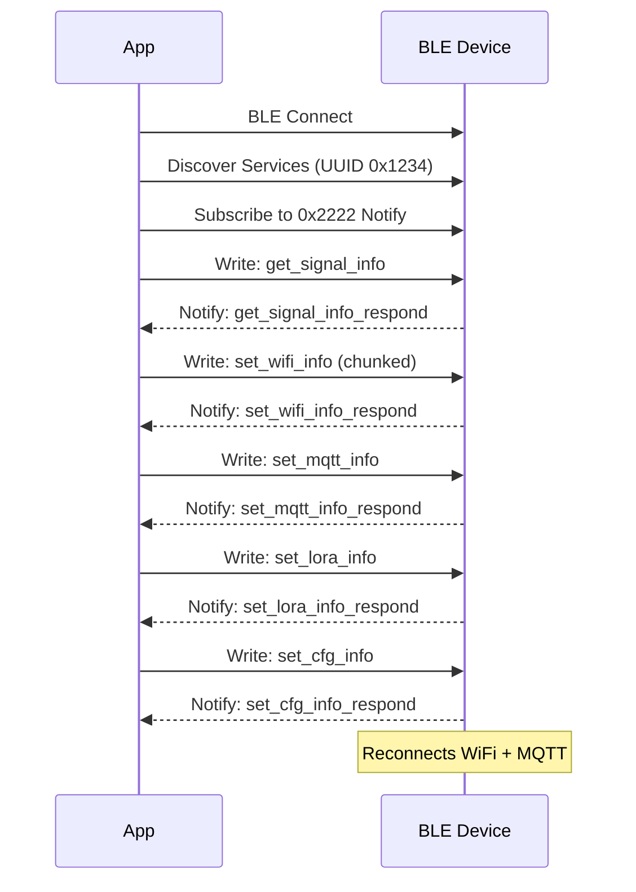

# BLE Protocol Overview

The Novabot app configures devices via **BLE GATT** (not via WiFi AP or MQTT).
Commands are sent as JSON over a GATT characteristic.

## GATT Service Structure

| Property | Value |
|----------|-------|
| Service UUID | `0x1234` |
| Characteristic `0x2222` | Write Without Response + Notify (commands) |
| Characteristic `0x3333` | Read + Write Without Response |

## BLE Device Names

| Device | BLE Name | Name Match (case-insensitive) |
|--------|----------|------------------------------|
| Charger | `CHARGER_PILE` | `chargerpile` |
| Mower | `Novabot` / `NOVABOT` | `novabot` |

## Frame Format

Large payloads are split into chunks of ~20-27 bytes, surrounded by ASCII markers:

```
ble_start
{"set_wifi_info":{"sta":{"ss
id":"MyNetwork","passwd":"pa
ssword123","encrypt":0},"ap"
:{"ssid":"LFIC1230700XXX","p
asswd":"12345678","encrypt":
0}}}
ble_end
```

## Command Flow



## BLE Commands Summary

| Command | Response | Description |
|---------|----------|-------------|
| `get_signal_info` | `get_signal_info_respond` | Read WiFi RSSI + GPS quality |
| `get_wifi_rssi` | `get_wifi_rssi_respond` | Read WiFi signal strength |
| `set_wifi_info` | `set_wifi_info_respond` | Set WiFi SSID + password |
| `set_mqtt_info` | `set_mqtt_info_respond` | Set MQTT broker host/port |
| `set_lora_info` | `set_lora_info_respond` | Set LoRa configuration |
| `set_rtk_info` | `set_rtk_info_respond` | Set RTK GPS configuration |
| `set_para_info` | `set_para_info_respond` | Set other parameters |
| `set_cfg_info` | `set_cfg_info_respond` | Commit/activate configuration |

See [Charger Provisioning](charger-provisioning.md) and [Mower Provisioning](mower-provisioning.md) for detailed flows.

See [BLE Commands](commands.md) for full payload specifications.

!!! info "Provisioning mode only"
    Devices do NOT respond to BLE commands when already connected to WiFi+MQTT (operational mode). BLE provisioning only works when the device is in setup mode.
