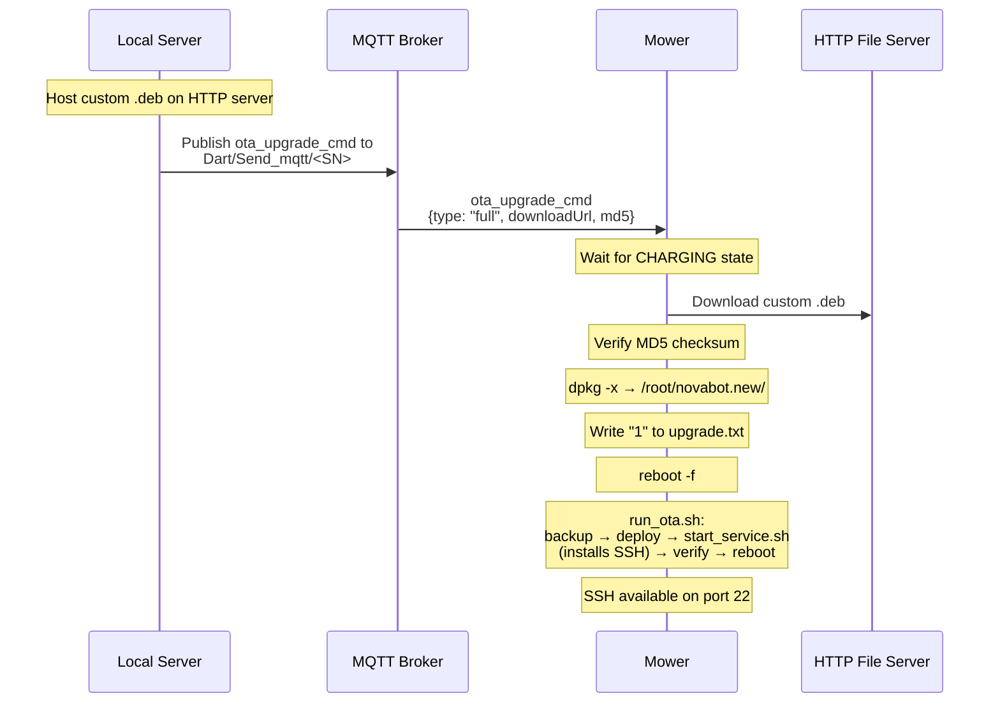

# Custom Firmware

## Feasibility Assessment

Can we build custom firmware for the Novabot charger and mower without the original source code? The answer depends on the device.

### Charger (ESP32-S3) — Fully Feasible

| Aspect | Status | Details |
|--------|--------|---------|
| **Decompilation** | Complete | Ghidra: 7405 functions, 296K lines of C |
| **Architecture** | Simple | MQTT ↔ LoRa bridge, 3 FreeRTOS tasks |
| **Framework** | Known | ESP-IDF v4.4.2 (open source) |
| **Protocol** | Documented | All MQTT commands, LoRa packets, BLE provisioning mapped |
| **Hardware** | Identified | ESP32-S3, GD25Q64 flash, EBYTE LoRa, UM960 RTK |
| **Binary patching** | Working | MQTT host replacement tool available |
| **Rebuild from scratch** | Feasible | Clean-room ESP-IDF project possible |

The charger is architecturally simple: it receives JSON commands via MQTT, translates them to binary LoRa packets, and vice versa. With 7405 decompiled functions, every code path is visible. A complete rewrite in ESP-IDF is realistic.

### Mower (Horizon X3 / Linux) — Modifiable, Not Rebuildable

| Aspect | Status | Details |
|--------|--------|---------|
| **OS** | Full Linux | Ubuntu/Debian ARM64, ROS 2 Galactic |
| **Firmware format** | Debian package | `.deb` with 7570 files |
| **Core binaries** | Compiled C++ | ~40 ELF binaries, 239 shared libraries |
| **Scripts** | Editable | 575 shell, 298 Python, 136 YAML configs |
| **AI models** | Binary | 2 DNN models (8.1MB + 3.6MB), not editable |
| **Rebuild from scratch** | Not feasible | Requires ROS 2 source, Horizon BPU SDK, camera drivers |
| **Modify and repackage** | **Fully feasible** | Unpack .deb → edit scripts/configs → repack → OTA flash |

The mower firmware is a Debian package. While the compiled ROS 2 nodes cannot be rebuilt without source code, the **scripts, configs, and system settings are fully editable**. This covers the most important modifications:

- SSH server installation
- Server URL configuration
- Network settings
- Startup behavior
- Camera and sensor parameters

---

## Mower .deb Firmware Composition

```
Total files: 7570

By type:
├── Shell scripts:     575  (editable)
├── Python scripts:    298  (editable)
├── YAML configs:      136  (editable)
├── JSON configs:       45  (editable)
├── Launch files:       38  (editable)
├── ELF binaries:      ~40  (compiled C++)
├── Shared libraries:  239  (.so files)
├── AI models:           2  (Horizon BPU format)
├── Camera calibration: 12  (JSON/txt)
└── Other:           ~6185  (ROS packages, headers, cmake, etc.)
```

**Key insight:** Over 1000 files are directly editable text. The OTA system (`dpkg -x`) simply extracts the .deb content, making modification straightforward.

---

## What Can Be Modified

### Without Source Code (script/config level)

| Modification | Method | Files |
|-------------|--------|-------|
| **Install SSH server** | Add `apt install openssh-server` to `start_service.sh` | `scripts/start_service.sh` |
| **Change server URLs** | Override `/userdata/lfi/http_address.txt` at boot | `scripts/run_novabot.sh` + new script |
| **Change MQTT host** | Already configurable via BLE/json_config.json | DNS redirect or BLE re-provisioning |
| **Enable ROS 2 network** | Remove `ROS_LOCALHOST_ONLY=1` | `scripts/run_novabot.sh` |
| **Camera streaming** | Add ROS 2 bridge node (Python) | New Python node |
| **Perception tuning** | Adjust thresholds, modes | `perception_conf/*.yaml` |
| **Navigation params** | Tune planners, costmap | Nav2 YAML configs |
| **Disable AI perception** | Toggle startup scripts | `debug_sh/disable_perception.sh` |
| **Add custom services** | systemd unit files | `scripts/*.service` |
| **Log management** | Change upload URLs, retention | `log_manager.yaml` |
| **Timezone** | Already handled in OTA flow | `start_service.sh` |

### Requires Source Code (binary level)

| Modification | Reason |
|-------------|--------|
| MQTT protocol changes | Hardcoded in `mqtt_node` (6.3MB ELF) |
| New ROS 2 service types | Requires message compilation |
| Camera driver modifications | Compiled `camera_307_cap` binary |
| Motor control changes | Compiled `chassis_control` binary |
| AI model replacement | Requires Horizon BPU toolchain |

---

## Build Process

### Custom Mower Firmware Builder


!!! lock "Private section"
    This section contains sensitive security details (encryption keys, credentials,
    vulnerability specifics) and is only available in the private wiki.


The general approach for building custom mower firmware:

```
1. Extract original .deb:
   ar x mower_firmware_v5.7.1.deb
   tar -xf data.tar.xz

2. Modify scripts, configs, add new files

3. Repackage:
   tar -cJf data.tar.xz .
   ar rcs custom_firmware.deb debian-binary control.tar.xz data.tar.xz
```

The `.deb` uses flat directory structure (not `root/novabot/`), and the OTA system extracts it via `dpkg -x` to `/root/novabot.new/`.

---

## OTA Flash Process

Custom firmware is installed via the standard OTA mechanism — no physical access needed:



### Prerequisites

1. **Mower must be charging** — OTA download only starts when `battery_state == "CHARGING"`
2. **HTTP file server** — host the .deb file on a server reachable by the mower
3. **MQTT access** — ability to publish to `Dart/Send_mqtt/<SN>`
4. **Correct MD5** — the mower verifies the checksum before installing


!!! lock "Private section"
    This section contains sensitive security details (encryption keys, credentials,
    vulnerability specifics) and is only available in the private wiki.


### Safety & Rollback

The mower has a built-in rollback mechanism:

1. Before installing, current firmware is backed up to `/root/novabot.bak/`
2. After extraction, the installer checks if `run_novabot.sh` exists and is non-empty
3. If the check fails, the installer automatically restores from backup
4. User data (maps, CSV files, charging station config) is preserved across updates

!!! tip "Always test modifications incrementally"
    Start with minimal changes (just SSH) before adding more modifications. The rollback mechanism protects against broken firmware, but it's better to be cautious.

---

## Charger Firmware Modification

### Binary Patching (v0.3.6 / v0.4.0)

Since the charger firmware is a single binary image (not a package), modification requires binary patching:


!!! lock "Private section"
    This section contains sensitive security details (encryption keys, credentials,
    vulnerability specifics) and is only available in the private wiki.


The charger binary contains hardcoded MQTT server hostnames. These can be patched using binary search-and-replace with SHA256 hash recalculation. The ESP32-S3 OTA system validates the image header checksum, so the hash must be updated after patching.

### Full Rewrite (ESP-IDF)

A complete charger firmware rewrite is feasible:

| Component | Source | Effort |
|-----------|--------|--------|
| **MQTT client** | ESP-IDF `esp_mqtt` | Low (well documented) |
| **LoRa driver** | EBYTE E32/E22 UART protocol | Medium (fully reverse-engineered) |
| **BLE provisioning** | ESP-IDF `esp_ble_gatts` | Medium (GATT service 0x1234) |
| **WiFi management** | ESP-IDF `esp_wifi` | Low (standard API) |
| **GPS/RTK** | NMEA parser for UM960 | Low (standard protocol) |
| **NVS storage** | ESP-IDF `nvs_flash` | Low (standard API) |
| **OTA** | ESP-IDF `esp_ota_ops` | Low (standard API) |
| **Command dispatch** | cJSON + switch table | Medium (all commands documented) |
| **Status reporting** | cJSON + timer | Low (format fully known) |

**Estimated complexity:** ~3000-5000 lines of C, primarily mapping between JSON and LoRa binary packets. The complete LoRa protocol, MQTT command set, BLE provisioning flow, and NVS storage format are all documented.

---

## MQTT Host Configuration

Understanding how each device gets its MQTT server address is crucial for custom firmware:

| Device | Primary Source | Fallback | Needs Binary Patching? |
|--------|---------------|----------|----------------------|
| **Charger** | NVS `mqtt_data` (set via BLE) | Hardcoded in binary | Only for fallback IP |
| **Mower** | `/userdata/lfi/json_config.json` (set via BLE) | Hardcoded in `mqtt_node` | No — DNS redirect works |

For the mower, the primary MQTT host comes from BLE provisioning and is stored in a JSON config file. DNS redirection (`mqtt.lfibot.com` → local server IP) is sufficient — no binary modification needed.

For the charger, the primary MQTT host is stored in NVS (set via BLE provisioning). The hardcoded fallback IP in the binary is only used when DNS resolution fails completely.

---

## HTTP Server URL Configuration

The mower's `mqtt_node` reads the HTTP server URL from `/userdata/lfi/http_address.txt`. This is used for:

- Map ZIP uploads (`uploadEquipmentMap`)
- Track uploads (`uploadEquipmentTrack`)
- Work record saving (`saveCutGrassRecord`)
- Plan queries (`queryPlanFromMachine`)

Custom firmware overrides this file at every boot to ensure it always points to the local server, even if the mower's firmware tries to reset it.
