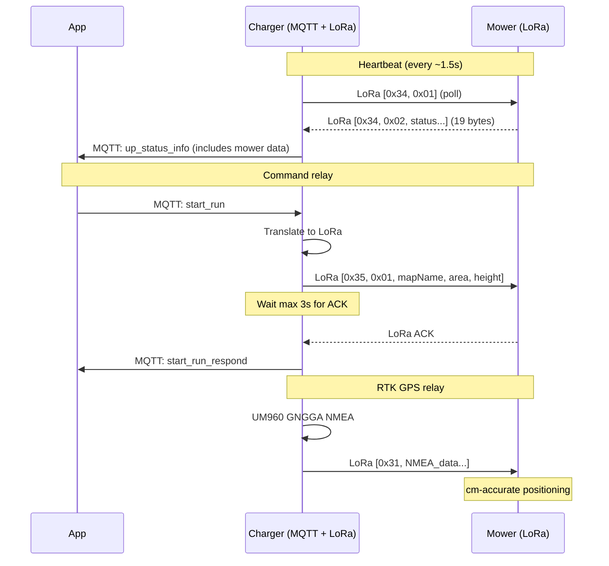

# LoRa Protocol

The charger acts as a **MQTT ↔ LoRa bridge**. It translates all MQTT JSON commands into binary LoRa packets and vice versa.

## Hardware

| Property | Value |
|----------|-------|
| Module | EBYTE E32/E22 series |
| Frequency | 433 MHz |
| UART | UART1 (TX=GPIO17, RX=GPIO18) |
| Mode pins | M0=GPIO12, M1=GPIO46 |

### Operating Modes

| M0 | M1 | Mode |
|----|-----|------|
| 0 | 0 | Normal/transparent (data) |
| 1 | 1 | Configuration (AT-commands) |

## Packet Format

```
┌──────┬──────┬──────┬──────┬───────┬─────────────┬──────────┬──────┬──────┐
│ 0x02 │ 0x02 │ ADDR │ ADDR │ LEN+1 │ PAYLOAD...  │ XOR CSUM │ 0x03 │ 0x03 │
│ Start│ Start│ High │ Low  │       │             │          │ End  │ End  │
└──────┴──────┴──────┴──────┴───────┴─────────────┴──────────┴──────┴──────┘
```

| Offset | Size | Value | Description |
|--------|------|-------|-------------|
| 0-1 | 2 | `0x02, 0x02` | Start bytes |
| 2-3 | 2 | Address | `0x00, 0x03` (TX to mower) / `0x00, 0x01` (RX from mower) |
| 4 | 1 | `len+1` | Payload length + 1 |
| 5..5+n | n | varies | Payload (command byte + data) |
| 5+n | 1 | XOR | XOR checksum over all payload bytes |
| 6+n, 7+n | 2 | `0x03, 0x03` | End bytes |

### Addresses

| Address | Device |
|---------|--------|
| `0x00, 0x03` | Charger (sender) |
| `0x00, 0x01` | Mower (receiver) |

## Command Categories

The first byte of the payload identifies the command category:

| Byte | Category | Description |
|------|----------|-------------|
| `0x30` ('0') | CHARGER | Charger hardware (Hall sensor ACK, IRQ ACK) |
| `0x31` ('1') | RTK_RELAY | RTK GPS NMEA data relay to mower |
| `0x32` ('2') | CONFIG | Configuration commands |
| `0x33` ('3') | GPS | GPS position data (lat/lon/alt, 16 bytes) |
| `0x34` ('4') | REPORT | Status reports (heartbeat poll + mower data) |
| `0x35` ('5') | ORDER | Mowing commands (start/pause/stop/go_pile) |
| `0x36` ('6') | SCAN_CHANNEL | LoRa channel scan |

See [LoRa Packets](lora-packets.md) for detailed packet structures.
See [LoRa Command Mapping](lora-commands.md) for MQTT ↔ LoRa translation table.

## Communication Flow



## RSSI Measurement

```
Query:    [0xC0, 0xC1, 0xC2, 0xC3, 0x00, 0x01]
Response: [0xC1, 0x00, 0x01, <RSSI byte>]
```

- RSSI < 146 (0x92) = good signal
- Channel scan: tries all channels from `lc` to `hc`, sorts by RSSI (bubble sort), picks best
