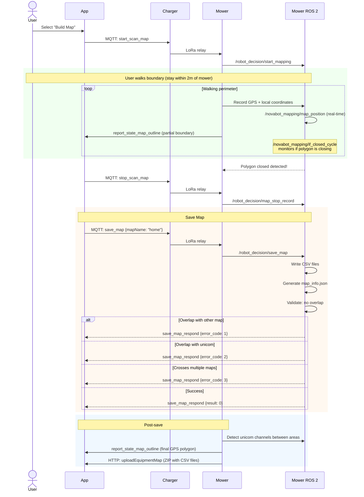
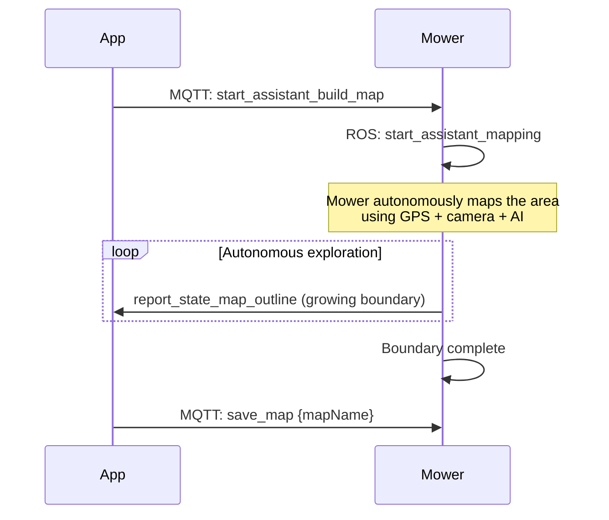
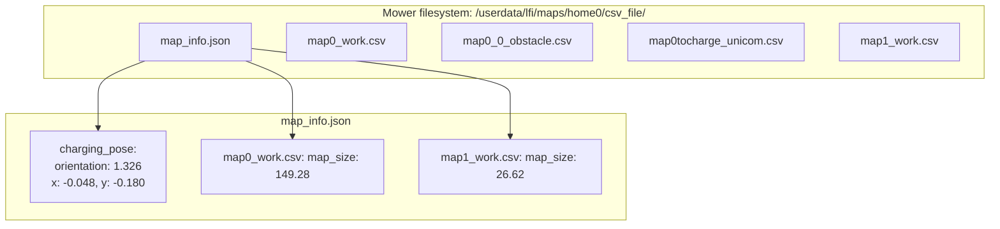

# Flow: Map Building

## Manual Mapping (Walk the Boundary)

## Automatic Mapping

## Map File Structure

## Map Types

| Type | File Pattern | Description | Limits |
|------|-------------|-------------|--------|
| Work area | `map{N}_work.csv` | Lawn to be mowed | Max 3 |
| Obstacle | `map{N}_{M}_obstacle.csv` | Areas to avoid | Min 1m from boundary |
| Channel | `map{N}to{target}_unicom.csv` | Narrow passages | Min 1m wide, max 10m straight |

## Three Map Sync Options

```mermaid
graph TB
    subgraph "Option 1: SPECIFIED_AREA (no physical mapping needed)"
        A1[Dashboard: Draw polygon on satellite photo]
        A2[start_run with polygon_area + cov_mode=1]
        A3[Mower mows within GPS polygon]
        A1 --> A2 --> A3
    end

    subgraph "Option 2: Direct CSV Upload (requires SSH)"
        B1[Dashboard: Export ZIP via mapConverter.ts]
        B2[SCP to /userdata/lfi/maps/home0/csv_file/]
        B3[Maps persisted on mower]
        B1 --> B2 --> B3
    end

    subgraph "Option 3: Physical Mapping"
        C1[Walk boundary with mower]
        C2[save_map via MQTT]
        C3[Mower writes CSV + uploads ZIP to server]
        C1 --> C2 --> C3
    end

    style A1 fill:#9f9,stroke:#333
    style B1 fill:#ff9,stroke:#333
    style C1 fill:#f99,stroke:#333
```

