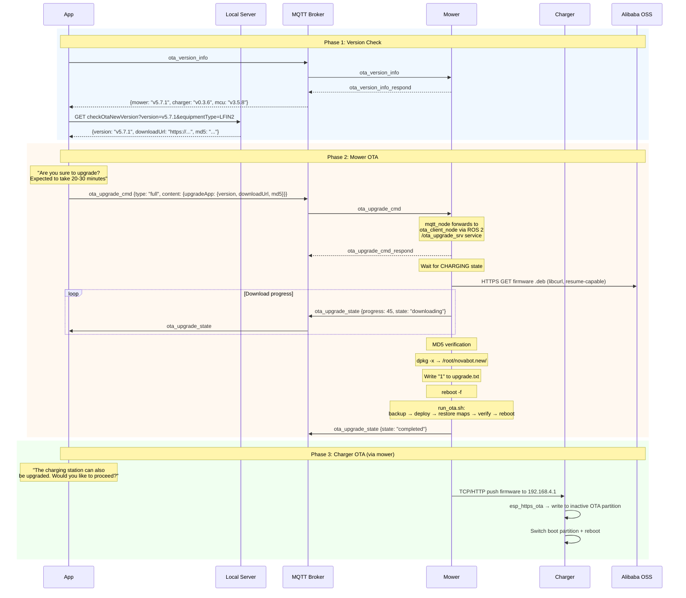
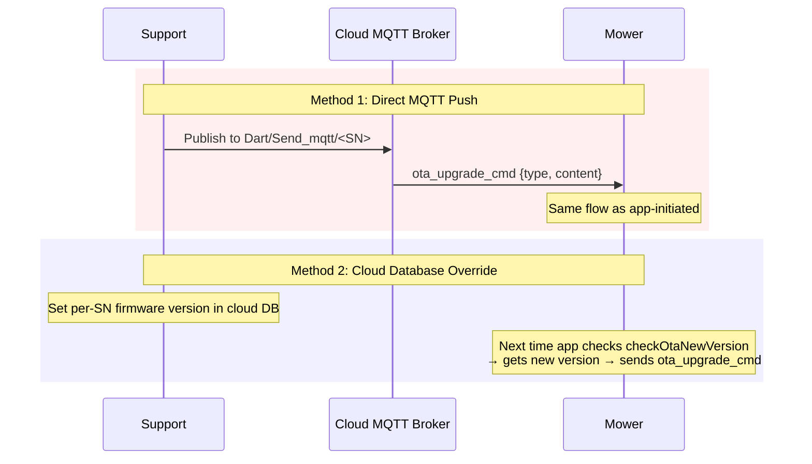
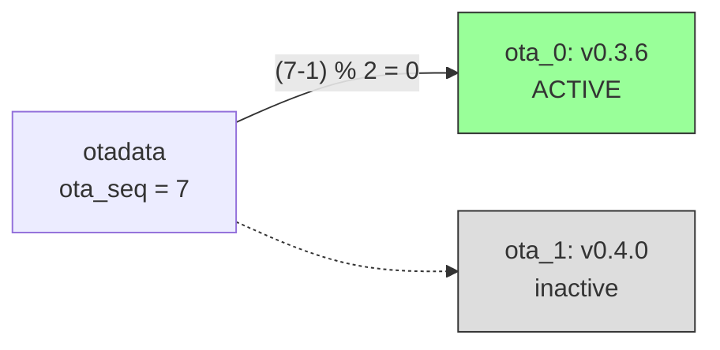

# Flow: OTA Firmware Update

## Overview

The OTA update system supports both **app-initiated** updates (user checks for updates) and **remote push** updates (support sends firmware directly via MQTT). The mower has a production-grade OTA pipeline with resume-capable downloads, MD5 verification, atomic replacement, and automatic rollback.

## App-Initiated Update Flow



## Remote Push (Support-Initiated)

Support can push firmware to a specific device **without user interaction** via two mechanisms:



!!! warning "No authentication on OTA commands"
    Any MQTT message on `Dart/Send_mqtt/<SN>` with `ota_upgrade_cmd` triggers a firmware download. There is no verification of the sender's identity.

---

## `ota_upgrade_cmd` JSON Format

```json title="Full firmware upgrade"
{
  "ota_upgrade_cmd": {
    "type": "full",
    "content": {
      "upgradeApp": {
        "version": "v5.7.1",
        "downloadUrl": "https://<oss-host>/novabot-file/<firmware-filename>.deb",
        "md5": "<md5-checksum>"
      }
    }
  }
}
```

### Upgrade Types

| Type | Description | Payload |
|------|-------------|---------|
| `full` | Full firmware replacement (.deb package) | `content.upgradeApp` |
| `increment` | Incremental app update | `content.upgradeApp` |
| `file_update` | Individual file updates (.zip with manifest) | `content.upgradeApp` (zip with `check.json`) |

!!! lock "Private section"
    This section contains sensitive security details (encryption keys, credentials,
    vulnerability specifics) and is only available in the private wiki.


---

## Mower OTA Architecture

The mower has **two ROS 2 nodes** that handle OTA:

```mermaid
graph LR
    MQTT[MQTT Broker] -->|ota_upgrade_cmd| MN[mqtt_node<br/>6.3MB]
    MN -->|/ota_upgrade_srv<br/>ROS 2 service| OC[ota_client_node<br/>5.8MB]
    OC -->|libcurl HTTPS| OSS[Alibaba OSS]
    OC -->|/ota/upgrade_status<br/>ROS 2 topic| MN
    MN -->|ota_upgrade_state| MQTT
    OC -->|Check| CS[/pipe_charge_status<br/>Charging required]

    style MN fill:#f9f,stroke:#333
    style OC fill:#9ff,stroke:#333
```

### ROS 2 Service: OtaUpgradeSys

```
# Request (mqtt_node → ota_client)
string ota_cmd          # Full JSON string from MQTT command

---

# Response (ota_client → mqtt_node)
bool state              # true = accepted, false = error
string state_out        # Status message
```

### OTA Client Launch Parameters

```yaml
upgrade_srv_name: /ota_upgrade_srv
ota_state_pub: /ota/upgrade_status
charging_state_sub: /pipe_charge_status
ota_data_dir_root: /userdata/ota
download_max_time: 86400          # 24 hours max download time
upgrade_app_subs_maxt: 600        # 10 minutes max per submodule
upgrade_file_enable: True
```

---

## Full Firmware Installation Flow

### Phase 1: Download (ota_client_node)

```
1. Receive ota_upgrade_cmd via /ota_upgrade_srv ROS 2 service
2. Parse JSON: extract type, content.upgradeApp.{version, downloadUrl, md5}
3. Wait for mower to be in CHARGING state
   └─ If not charging: pause download, wait, retry every 60s
4. Download .deb to /userdata/ota/upgrade_pkg/
   └─ libcurl with HTTPS, resume-capable, max 24h timeout
5. Verify MD5 checksum
   └─ If mismatch: delete package, retry download
6. Extract: dpkg -x <package.deb> /root/novabot.new/
7. Verify extracted files via /root/novabot.new/package_verify.json
8. Copy charger firmware to /userdata/ota/charging_station_pkg/
9. Start submodule upgrades (charger OTA, max 10 min)
10. Copy run_ota.sh to /userdata/ota/run_ota.sh
11. Write "1" to /userdata/ota/upgrade.txt
12. reboot -f
```

### Phase 2: Install (run_ota.sh at boot)

```
1. Check /root/novabot.new exists AND /userdata/ota/upgrade.txt == "1"
2. Backup: mv /root/novabot → /root/novabot.bak
3. Deploy: cp -rfp /root/novabot.new → /root/novabot
4. Restore user data:
   └─ Maps, charging_station config, CSV files from backup
5. Run start_service.sh (install system libraries, services)
6. Optionally replace WiFi driver (bcm/)
7. Verify: /root/novabot/scripts/run_novabot.sh exists and non-empty
   └─ If missing: ROLLBACK (cp /root/novabot.bak → /root/novabot)
8. Write "0" to /userdata/ota/upgrade.txt
9. Clean up: rm -rf /root/novabot.new
10. Final reboot
```

---

## File Update Flow (`type: "file_update"`)

For updating individual files without full firmware replacement:

```
1. Download .zip package to /userdata/ota/download/
2. Verify MD5
3. Extract to /userdata/ota/download/unzip/
4. Parse check.json manifest:
   {
     "upgradeFiles": [
       {"filePath": "source/in/zip", "destPath": "/target/path", "checkWay": "md5"}
     ]
   }
5. For each file: verify, then replace at destPath
6. Report status to cloud
```

---

## Charger OTA

### Via Mower (Relay)

The mower pushes charger firmware to the charger via two methods:

| Method | Target | Protocol |
|--------|--------|----------|
| TCP socket | `192.168.4.1` | Raw TCP, firmware in chunks |
| HTTP POST | `http://192.168.4.1/setotadata` | HTTP multipart |

Firmware source: `/userdata/ota/charging_station_pkg/lfi-charging-station_lora.bin`

### Direct (Charger Own OTA)

The charger can also handle `ota_upgrade_cmd` directly:

1. Receives command via MQTT (handled locally, no LoRa relay)
2. Downloads firmware via `esp_https_ota()` (ESP-IDF library)
3. Writes to **inactive** OTA partition
4. Updates `otadata` to switch boot partition
5. Reboots



---


!!! lock "Private section"
    This section contains sensitive security details (encryption keys, credentials,
    vulnerability specifics) and is only available in the private wiki.


## Known Firmware Versions

| Device | Version | Size | Notes |
|--------|---------|------|-------|
| Charger | v0.3.6 | 1.4 MB | ESP32-S3, ESP-IDF v4.4.2, plain JSON MQTT |
| Charger | v0.4.0 | 1.4 MB | Adds AES-128-CBC MQTT encryption + `cJSON_IsNull` command validation |
| Mower | v5.7.1 | 35 MB | Debian/ROS 2, Horizon X3 |
| Mower | v6.0.3 | ? | Pushed to select users by support |
| MCU | v3.5.8 | — | STM32F407 motor controller |

## File System Paths

| Path | Description |
|------|-------------|
| `/userdata/ota/upgrade.txt` | Flag: "0"=no update, "1"=pending |
| `/userdata/ota/upgrade_pkg/` | Downloaded .deb packages |
| `/userdata/ota/download/` | Downloaded .zip packages (file_update) |
| `/userdata/ota/run_ota.sh` | OTA startup script (updated during OTA) |
| `/userdata/ota/novabot_timezone.txt` | Timezone from OTA command |
| `/userdata/ota/charging_station_pkg/` | Charger firmware for relay |
| `/userdata/ota/ota_client.log` | OTA operation log |
| `/userdata/lfi/system_version.txt` | Current system version |
| `/root/novabot/` | Active firmware installation |
| `/root/novabot.new/` | Extracted new firmware (pre-reboot) |
| `/root/novabot.bak/` | Backup of previous firmware (rollback) |

## OTA Client Version History

| Version | Date | Developer | Changes |
|---------|------|-----------|---------|
| Pre-V0.0.1 | 2022 | Li Qiang | Initial: download, extract, replace |
| V0.0.1 | 2023/04 | Cai Tao | Weak network download, ROS service API, breakpoint resume |
| V0.0.2 | 2023/05 | Cai Tao | Charge-state pause/resume, progress reporting |
| V0.0.3 | 2023/10 | Cai Tao | MD5 verification, file size verification |
| V0.0.4 | 2024/02 | Cai Tao | File update feature (`file_update` type) |


!!! lock "Private section"
    This section contains sensitive security details (encryption keys, credentials,
    vulnerability specifics) and is only available in the private wiki.


---


!!! lock "Private section"
    This section contains sensitive security details (encryption keys, credentials,
    vulnerability specifics) and is only available in the private wiki.

