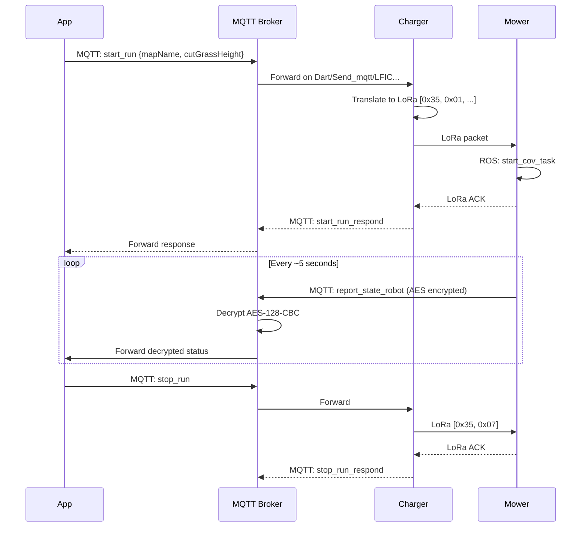

# Mowing Commands

All mowing commands are sent to `Dart/Send_mqtt/<SN>`.

## start_run

Start a mowing session.

**Direction**: App → Charger (via MQTT) → Mower (via LoRa)
**LoRa mapping**: Queue `0x20`, payload `[0x35, 0x01, mapName, area, cutterHeight]`
**ROS service**: `/robot_decision/start_cov_task` → `StartCoverageTask.srv`

```json title="Command"
{
  "start_run": {
    "mapName": "map0",
    "cutGrassHeight": 5,
    "workArea": "map0",
    "startWay": "app",
    "schedule": false,
    "scheduleId": "",
    "mapNames": ["map0"]
  }
}
```

| Field | Type | Description |
|-------|------|-------------|
| `mapName` | string | Map to mow |
| `cutGrassHeight` | number | Blade height (0-7, height = (level+2)×10 mm) |
| `workArea` | string | Working area name |
| `startWay` | string | Trigger source: `"app"` or `"schedule"` |
| `schedule` | boolean | Is this a scheduled mow? |
| `scheduleId` | string | Schedule UUID if scheduled |
| `mapNames` | string[] | List of map names to mow |

```json title="Response"
{
  "type": "start_run_respond",
  "message": {
    "result": 0,
    "value": null
  }
}
```

### ROS Service: StartCoverageTask.srv

The mower's `mqtt_node` translates this to a ROS 2 service call:

```
uint8 NORMAL=0              # Mow saved map
uint8 SPECIFIED_AREA=1      # Mow within provided polygon (GPS points)
uint8 BOUNDARY_COV=2        # Boundary-only mowing

uint8 cov_mode              # Mowing mode (0/1/2)
uint8 request_type          # Source: 11=app, 12=schedule, 21=MCU, 22=MCU schedule
uint32 map_ids              # Map ID (priority over map_names if > 0)
string[] map_names          # Map names to mow
geometry_msgs/Point[] polygon_area  # GPS polygon (for SPECIFIED_AREA)
uint8[] blade_heights       # Blade heights (0-7)
bool specify_direction
uint8 cov_direction         # Mowing direction 0-180°
uint8 light                 # LED brightness
bool specify_perception_level
uint8 perception_level      # 0=off, 1=detection, 2=segmentation, 3=sensitive
uint8 blade_info_level      # 0=default, 1=all off, 2=buzzer, 3=LED, 4=all on
bool night_light            # Allow night LED
bool enable_loc_weak_mapping
bool enable_loc_weak_working
---
bool result
```

!!! tip "SPECIFIED_AREA mode"
    With `cov_mode=1`, the mower can mow within GPS polygon coordinates passed via `polygon_area`, without needing a saved map on the device.

---

## stop_run

Stop the current mowing session.

**LoRa mapping**: Queue `0x23`, payload `[0x35, 0x07]`
**ROS service**: `/robot_decision/stop_task`

```json title="Command"
{
  "stop_run": {}
}
```

```json title="Response"
{
  "type": "stop_run_respond",
  "message": { "result": 0, "value": null }
}
```

---

## pause_run

Pause the current mowing session.

**LoRa mapping**: Queue `0x21`, payload `[0x35, 0x03]`

```json title="Command"
{
  "pause_run": {}
}
```

```json title="Response"
{
  "type": "pause_run_respond",
  "message": { "result": 0, "value": null }
}
```

---

## resume_run

Resume a paused mowing session.

**LoRa mapping**: Queue `0x22`, payload `[0x35, 0x05]`

```json title="Command"
{
  "resume_run": {}
}
```

```json title="Response"
{
  "type": "resume_run_respond",
  "message": { "result": 0, "value": null }
}
```

---

## stop_time_run

Stop a timer/scheduled mowing task.

**LoRa mapping**: Queue `0x24`, payload `[0x35, 0x09]`

```json title="Command"
{
  "stop_time_run": {}
}
```

---

## Timer-Related Mowing Commands

See also [Device Management → Timer/Scheduling](device-management.md#timer_task) for `timer_task`, `timer_task_active`, and `timer_task_stop`.

---

## Mowing Command Flow



## Complete Command Summary

| Command | Response | LoRa Queue | LoRa Payload | ROS Service |
|---------|----------|-----------|-------------|-------------|
| `start_run` | `start_run_respond` | `0x20` | `[0x35, 0x01, mapName, area(2B), cutterHeight]` | `/robot_decision/start_cov_task` |
| `stop_run` | `stop_run_respond` | `0x23` | `[0x35, 0x07]` | `/robot_decision/stop_task` |
| `pause_run` | `pause_run_respond` | `0x21` | `[0x35, 0x03]` | — |
| `resume_run` | `resume_run_respond` | `0x22` | `[0x35, 0x05]` | — |
| `stop_time_run` | `stop_time_run_respond` | `0x24` | `[0x35, 0x09]` | — |

!!! info "LoRa ACK mechanism"
    For all LoRa-relayed commands, the charger:

    1. Resets ACK flag (`DAT_42000c88 = 0`)
    2. Sends LoRa queue byte with 1000ms timeout
    3. Polls up to 3 times (1000ms each) for ACK:
        - `0x01` = success → `result: 0`
        - `0x101` = failure → `result: 1`
    4. After 3 failures → timeout → `result: 1`
