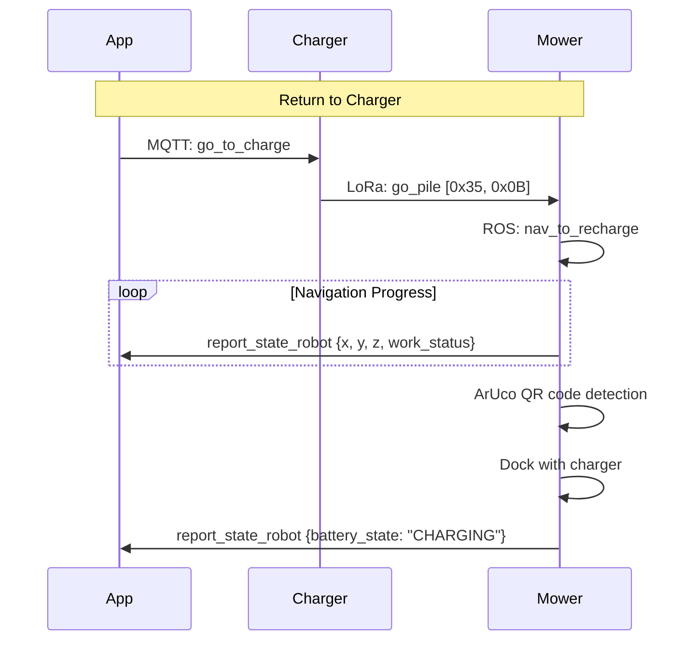

# Navigation Commands

## Point-to-Point Navigation

### start_navigation

Start point-to-point navigation to a target location.

```json title="Command"
{
  "start_navigation": {
    "latitude": 52.1409,
    "longitude": 6.2310
  }
}
```

```json title="Response"
{
  "type": "start_navigation_respond",
  "message": { "result": 0, "value": null }
}
```

---

### stop_navigation

Stop current navigation.

```json title="Command"
{
  "stop_navigation": {}
}
```

---

### pause_navigation

Pause current navigation.

```json title="Command"
{
  "pause_navigation": {}
}
```

---

### resume_navigation

Resume paused navigation.

```json title="Command"
{
  "resume_navigation": {}
}
```

---

### navigate_to_position

Navigate to a specific GPS position with optional arrival angle. More explicit than `start_navigation`.

!!! note "Discovered in mower firmware"
    This command was found in the `mqtt_node` binary and is separate from `start_navigation`. It supports an `angle` parameter for the desired heading at arrival.

```json title="Command"
{
  "navigate_to_position": {
    "latitude": 52.1409,
    "longitude": 6.2310,
    "angle": 0.0
  }
}
```

| Parameter | Type | Required | Description |
|-----------|------|----------|-------------|
| `latitude` | float | Yes | Target GPS latitude (WGS84) |
| `longitude` | float | Yes | Target GPS longitude (WGS84) |
| `angle` | float | No | Desired heading at arrival (degrees, default 0.0) |

```json title="Response"
{
  "type": "navigate_to_position_respond",
  "message": { "result": 0, "value": null }
}
```

---

## Timed Navigation

### start_time_navigation

Start a timed/scheduled navigation task.

```json title="Command"
{
  "start_time_navigation": {}
}
```

```json title="Response"
{
  "type": "start_time_navigation_respond",
  "message": { "result": 0, "value": null }
}
```

---

### stop_time_navigation

Stop a timed/scheduled navigation task.

```json title="Command"
{
  "stop_time_navigation": {}
}
```

```json title="Response"
{
  "type": "stop_time_navigation_respond",
  "message": { "result": 0, "value": null }
}
```

---

## Navigation Speed

### set_navigation_max_speed

Set the maximum speed during navigation.

```json title="Command"
{
  "set_navigation_max_speed": {
    "max_speed": 0.5
  }
}
```

```json title="Response"
{
  "type": "set_navigation_max_speed_respond",
  "message": { "result": 0, "value": null }
}
```

---

## Patrol Mode

!!! info "New --- discovered in mower firmware"
    Patrol mode is a separate operational mode from mowing and navigation. The mower follows a predefined patrol route.

### start_patrol

Start patrol mode.

```json title="Command"
{
  "start_patrol": {}
}
```

```json title="Response"
{
  "type": "start_patrol_respond",
  "message": { "result": 0, "value": null }
}
```

---

### stop_patrol

Stop patrol mode.

```json title="Command"
{
  "stop_patrol": {}
}
```

```json title="Response"
{
  "type": "stop_patrol_respond",
  "message": { "result": 0, "value": null }
}
```

---

## Charging / Docking

### go_to_charge

Navigate back to the charging station.

**ROS service**: `/robot_decision/nav_to_recharge`

```json title="Command"
{
  "go_to_charge": {}
}
```

```json title="Response"
{
  "type": "go_to_charge_respond",
  "message": { "result": 0, "value": null }
}
```

---

### go_pile

Navigate to the charging pile.

**LoRa mapping**: Queue `0x25`, payload `[0x35, 0x0B]`

```json title="Command"
{
  "go_pile": {}
}
```

```json title="Response"
{
  "type": "go_pile_respond",
  "message": { "result": 0, "value": null }
}
```

---

### stop_to_charge

Cancel return-to-charger navigation.

**ROS service**: `/robot_decision/cancel_recharge`

```json title="Command"
{
  "stop_to_charge": {}
}
```

---

### auto_recharge

Enable automatic recharge when battery is low.

**ROS service**: `/robot_decision/auto_recharge`

```json title="Command"
{
  "auto_recharge": {}
}
```

---

### auto_charge_threshold

Set the battery threshold for automatic recharging.

```json title="Command"
{
  "auto_charge_threshold": {
    "threshold": 20
  }
}
```

```json title="Response"
{
  "type": "auto_charge_threshold_respond",
  "message": { "result": 0, "value": null }
}
```

---

### get_recharge_pos

Get the saved charging station position.

```json title="Command"
{
  "get_recharge_pos": {}
}
```

```json title="Response"
{
  "type": "get_recharge_pos_respond",
  "message": {
    "result": 0,
    "value": {
      "latitude": 52.1409,
      "longitude": 6.2310,
      "orient_flag": 0
    }
  }
}
```

---

### save_recharge_pos

Save the current position as the charging station location.

**ROS service**: `/robot_decision/save_charging_pose`

```json title="Command"
{
  "save_recharge_pos": {}
}
```

---

## Manual Control (Joystick)

App route: `/manulController` (note: typo in app)

### start_move

Start manual movement. The app sends continuous position updates.

```json title="Command"
{
  "start_move": {
    "direction": 45,
    "speed": 0.5
  }
}
```

```json title="Response"
{
  "type": "start_move_respond",
  "message": { "result": 0, "value": null }
}
```

!!! info "Continuous updates"
    The app's `ManulControllerPageLogic` sends continuous `writeDataForMove` updates with direction/speed calculated from joystick offset.

---

### stop_move

Stop manual movement.

```json title="Command"
{
  "stop_move": {}
}
```

```json title="Response"
{
  "type": "stop_move_respond",
  "message": { "result": 0, "value": null }
}
```

---

## Navigation Flow



## Complete Command Summary

| Command | Response | Via Charger LoRa? | ROS Service |
|---------|----------|-------------------|-------------|
| `start_navigation` | `start_navigation_respond` | No (direct MQTT) | --- |
| `stop_navigation` | `stop_navigation_respond` | No | --- |
| `pause_navigation` | `pause_navigation_respond` | No | --- |
| `resume_navigation` | `resume_navigation_respond` | No | --- |
| `navigate_to_position` | `navigate_to_position_respond` | No | --- |
| `start_time_navigation` | `start_time_navigation_respond` | No | --- |
| `stop_time_navigation` | `stop_time_navigation_respond` | No | --- |
| `set_navigation_max_speed` | `set_navigation_max_speed_respond` | No | --- |
| `start_patrol` | `start_patrol_respond` | No | --- |
| `stop_patrol` | `stop_patrol_respond` | No | --- |
| `go_to_charge` | `go_to_charge_respond` | No | `/robot_decision/nav_to_recharge` |
| `go_pile` | `go_pile_respond` | **Yes** (LoRa `0x25`) | --- |
| `stop_to_charge` | `stop_to_charge_respond` | No | `/robot_decision/cancel_recharge` |
| `auto_recharge` | `auto_recharge_respond` | No | `/robot_decision/auto_recharge` |
| `auto_charge_threshold` | `auto_charge_threshold_respond` | No | --- |
| `get_recharge_pos` | `get_recharge_pos_respond` | No | --- |
| `save_recharge_pos` | `save_recharge_pos_respond` | No | `/robot_decision/save_charging_pose` |
| `start_move` | `start_move_respond` | No | --- |
| `stop_move` | `stop_move_respond` | No | --- |
