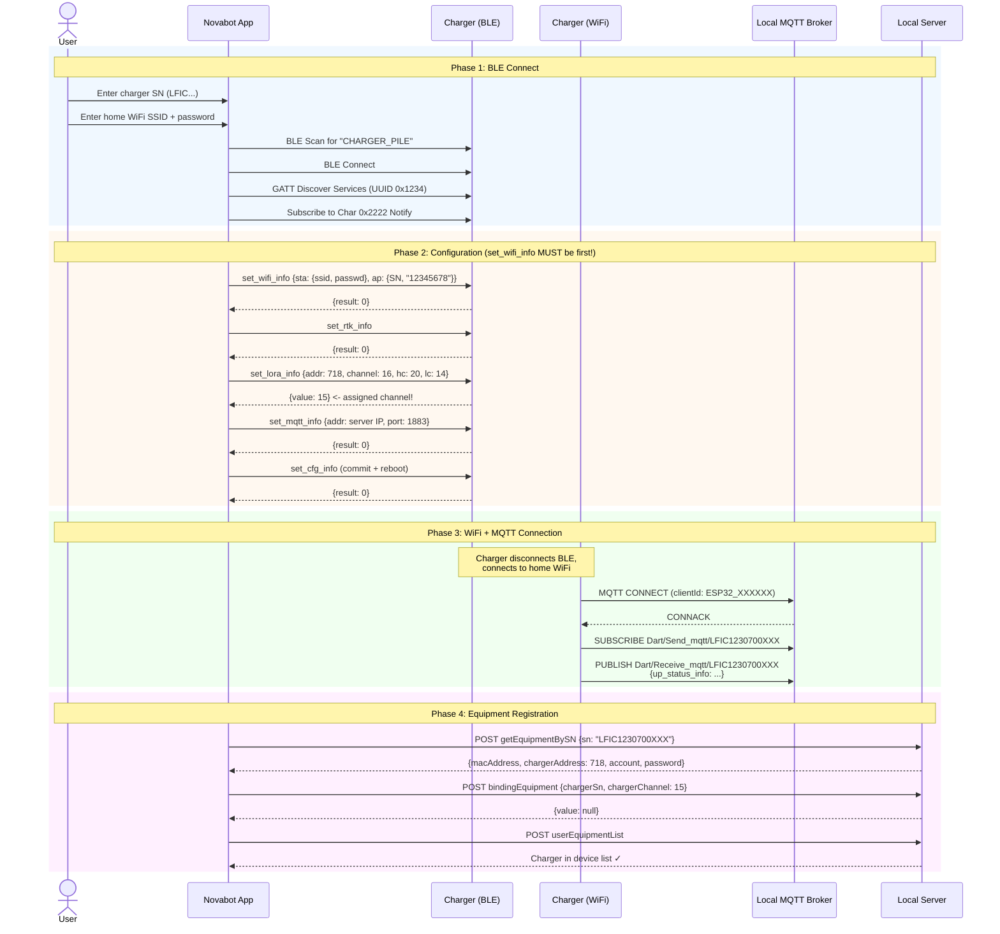

# Flow: Charger Provisioning

Complete flow from unboxing to operational charger.

## Key Observations

1. **`set_wifi_info` MUST be the first command** -- the charger's internal state machine switches from "provisioning" mode to "info" mode after receiving `get_signal_info`, causing it to ignore subsequent configuration commands
2. **chargerChannel** = value from `set_lora_info_respond` (15), NOT the requested channel (16)
3. **set_mqtt_info** sends NO credentials -- charger v0.3.6 doesn't use MQTT auth
4. **Charger AP password** is always `12345678`
5. After provisioning, charger tries both plain MQTT (1883) and TLS (fails with "Connection reset")
