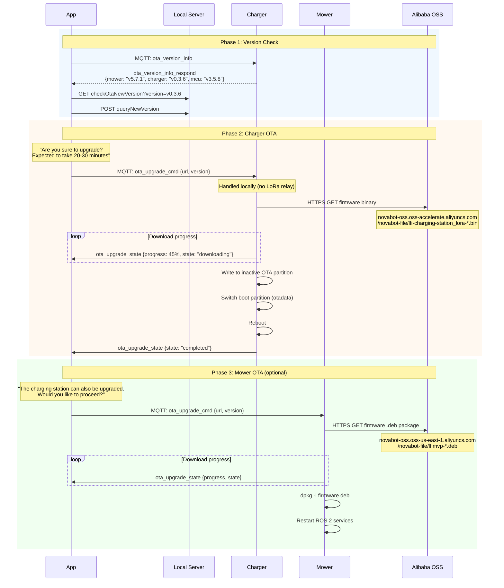
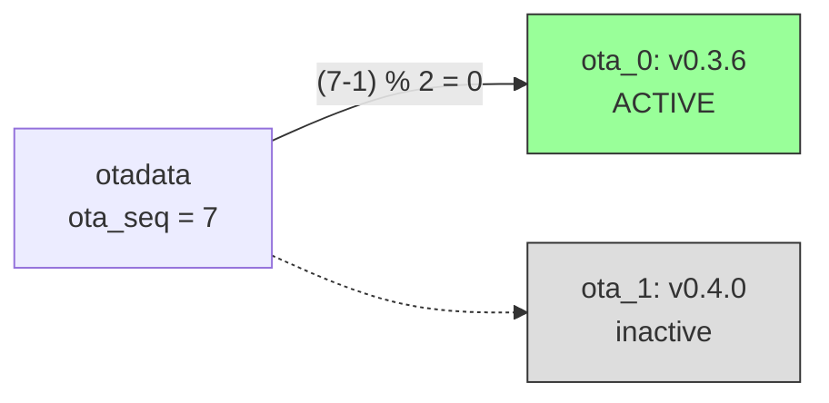

# Flow: OTA Firmware Update

## OTA Download URLs

| Device | URL Pattern |
|--------|------------|
| Charger | `https://novabot-oss.oss-accelerate.aliyuncs.com/novabot-file/lfi-charging-station_lora-{timestamp}.bin` |
| Mower | `https://novabot-oss.oss-us-east-1.aliyuncs.com/novabot-file/lfimvp-{date}{version}-{timestamp}.deb` |

## Known Firmware Versions

| Device | Version | Size | Notes |
|--------|---------|------|-------|
| Charger | v0.3.6 (active) | 1.4 MB | ESP32-S3, ESP-IDF v4.4.2 |
| Charger | v0.4.0 (inactive) | 1.4 MB | Adds AES MQTT encryption |
| Mower | v5.7.1 | 35 MB | Debian/ROS 2, Horizon X3 |
| MCU | v3.5.8 | — | STM32F407 motor controller |

## Charger OTA Partition Scheme

After OTA, the charger writes the new firmware to the **inactive** partition and updates `otadata` to boot from it.
