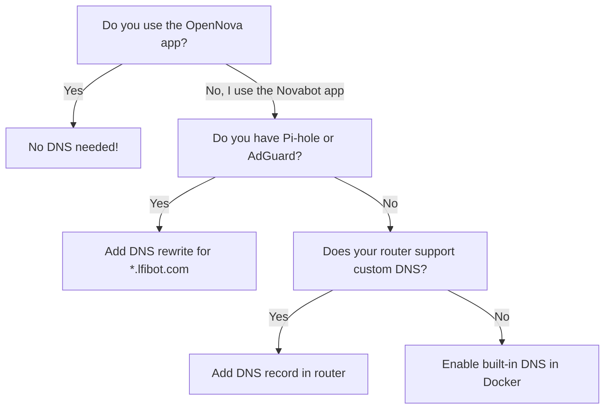

# DNS Setup Guide

!!! info "Who needs this?"
    DNS setup is **only needed if you use the original Novabot app** (iOS/Android). If you use the **OpenNova app**, you can skip this entirely — the app connects directly to your server IP.

## What is DNS and Why Do I Need It?

The Novabot mower and charger are programmed to connect to `mqtt.lfibot.com` (the Novabot cloud). We need to trick them into connecting to **your local server** instead.

**DNS** is like a phone book for the internet. When your mower looks up `mqtt.lfibot.com`, we want it to find your server's IP address instead of Novabot's cloud server.

```
Without DNS redirect:
  Mower asks: "Where is mqtt.lfibot.com?" → Internet: "47.253.145.99" (Novabot cloud)

With DNS redirect:
  Mower asks: "Where is mqtt.lfibot.com?" → Your DNS: "192.168.0.100" (your server!)
```

## Before You Start

You need to know **two things**:

### 1. Your OpenNova server IP address

This is the IP of the machine running the Docker container. Find it:

=== "Windows"
    Open Command Prompt and type:
    ```
    ipconfig
    ```
    Look for `IPv4 Address` under your WiFi or Ethernet adapter (e.g., `192.168.0.100`).

=== "macOS"
    Open Terminal and type:
    ```
    ipconfig getifaddr en0
    ```
    Or: System Settings → Network → WiFi → Details → IP Address.

=== "Linux"
    ```
    hostname -I | awk '{print $1}'
    ```

=== "Synology NAS"
    Control Panel → Network → Network Interface → Look for the IP.

### 2. Your router's admin page

Usually one of these addresses (type in your browser):

- `http://192.168.0.1`
- `http://192.168.1.1`
- `http://10.0.0.1`

The username/password is often on a sticker on the bottom of your router.

---

## Option A: Router DNS Override

The simplest method — change your router settings so ALL devices on your network resolve `mqtt.lfibot.com` to your server. No extra software needed.

### Fritz!Box

1. Open **http://fritz.box** in your browser
2. Go to **Home Network → Network → Network Settings**
3. Scroll to **DNS Rebind Protection**
4. Add an exception: `lfibot.com`
5. Go to **Internet → DNS Server**
6. Under **Local DNS entries**, add:
   - Host: `mqtt.lfibot.com` → IP: `192.168.0.100` (your server)
   - Host: `app.lfibot.com` → IP: `192.168.0.100` (your server)
7. Click **Apply**

### Ubiquiti UniFi (UDM / USG)

1. Open the **UniFi Network** app or **https://unifi.ui.com**
2. Go to **Settings → Networks → Default**
3. Under **DHCP Name Server**: set to **Manual**
4. Enter your Pi-hole/AdGuard IP as DNS server
5. **Apply Changes**

Or use the built-in DNS features:

1. SSH into your UDM: `ssh root@192.168.1.1`
2. Edit `/run/dnsmasq.conf.d/custom.conf`:
   ```
   address=/lfibot.com/192.168.0.100
   ```
3. Restart dnsmasq: `killall dnsmasq`

!!! warning
    UniFi UDM custom DNS entries may reset after firmware updates.

### TP-Link

1. Open **http://192.168.0.1** (or http://tplinkwifi.net)
2. Go to **Advanced → Network → DHCP Server**
3. Set **Primary DNS** to your Pi-hole/AdGuard IP
4. **Save**

TP-Link routers typically don't support custom DNS records. Use **Option B** (Pi-hole/AdGuard) instead.

### Netgear

1. Open **http://routerlogin.net** or **http://192.168.1.1**
2. Go to **Advanced → Setup → Internet Setup**
3. Under **DNS Address**: set to your Pi-hole/AdGuard IP
4. **Apply**

Like TP-Link, most Netgear routers need Pi-hole/AdGuard for custom DNS records.

### ASUS

1. Open **http://router.asus.com** or **http://192.168.1.1**
2. Go to **LAN → DNS Director**
3. Add a rule:
   - Domain: `mqtt.lfibot.com` → IP: `192.168.0.100`
   - Domain: `app.lfibot.com` → IP: `192.168.0.100`
4. **Apply**

!!! tip "Not all routers support custom DNS"
    If your router doesn't have DNS override options, use **Option B** (Pi-hole or AdGuard).

---

## Option B: Pi-hole

[Pi-hole](https://pi-hole.net) is a free DNS server that runs on a Raspberry Pi or in Docker. It blocks ads AND lets you create custom DNS records.

### Install Pi-hole

=== "Raspberry Pi"
    ```bash
    curl -sSL https://install.pi-hole.net | bash
    ```
    Follow the installer. Note the admin password at the end.

=== "Docker"
    ```yaml
    # docker-compose.yml
    services:
      pihole:
        image: pihole/pihole:latest
        ports:
          - "53:53/tcp"
          - "53:53/udp"
          - "8080:80/tcp"
        environment:
          WEBPASSWORD: 'your-password'
        volumes:
          - pihole-data:/etc/pihole
          - dnsmasq-data:/etc/dnsmasq.d
        restart: unless-stopped

    volumes:
      pihole-data:
      dnsmasq-data:
    ```

### Add DNS Records

1. Open Pi-hole admin: **http://pi-hole-ip/admin**
2. Log in with your password
3. Go to **Local DNS → DNS Records**
4. Add two records:

    | Domain | IP Address |
    |--------|-----------|
    | `mqtt.lfibot.com` | `192.168.0.100` |
    | `app.lfibot.com` | `192.168.0.100` |

    (Replace `192.168.0.100` with YOUR server IP)

5. Click **Add** for each

### Point Your Router to Pi-hole

1. Open your router admin page
2. Go to **DHCP Settings**
3. Change the **DNS server** to your Pi-hole's IP address
4. Save and reboot your router

Now all devices on your network use Pi-hole for DNS, and `mqtt.lfibot.com` resolves to your OpenNova server.

---

## Option C: AdGuard Home

[AdGuard Home](https://adguard.com/adguard-home/overview.html) is similar to Pi-hole but with a more modern interface.

### Install AdGuard Home

=== "Any platform"
    ```bash
    curl -s -S -L https://raw.githubusercontent.com/AdguardTeam/AdGuardHome/master/scripts/install.sh | sh -s -- -v
    ```

=== "Docker"
    ```yaml
    services:
      adguard:
        image: adguard/adguardhome:latest
        ports:
          - "53:53/tcp"
          - "53:53/udp"
          - "3001:3000/tcp"
          - "8080:80/tcp"
        volumes:
          - adguard-work:/opt/adguardhome/work
          - adguard-conf:/opt/adguardhome/conf
        restart: unless-stopped

    volumes:
      adguard-work:
      adguard-conf:
    ```

### Add DNS Rewrites

1. Open AdGuard Home: **http://adguard-ip:3001** (first time) or **http://adguard-ip:8080**
2. Go to **Filters → DNS Rewrites**
3. Click **Add DNS Rewrite**
4. Add two entries:

    | Domain | Answer |
    |--------|--------|
    | `mqtt.lfibot.com` | `192.168.0.100` |
    | `app.lfibot.com` | `192.168.0.100` |

5. Click **Save** for each

### Point Your Router to AdGuard

Same as Pi-hole — change your router's DHCP DNS server to AdGuard's IP.

---

## Option D: OpenNova Docker Built-in DNS

The OpenNova Docker container includes a built-in DNS server. This is the easiest option if you don't already have Pi-hole or AdGuard.

### Enable in docker-compose.yml

```yaml
services:
  opennova:
    ports:
      - "3000:80"
      - "1883:1883"
      - "53:53/udp"     # ← Uncomment this line
    environment:
      ENABLE_DNS: "true"               # ← Add this
      TARGET_IP: "192.168.0.100"       # ← Your server IP
      UPSTREAM_DNS: "8.8.8.8"          # ← Fallback DNS (Google)
```

Then restart:

```bash
docker compose down && docker compose up -d
```

### Point Your Router to OpenNova

Change your router's DHCP DNS server to your OpenNova server IP (`192.168.0.100`).

!!! note
    This means ALL DNS queries from your network go through OpenNova. Only `*.lfibot.com` is redirected — everything else is forwarded to Google DNS (or your configured upstream).

---

## How to Verify

After setting up DNS, test from any device on your network:

=== "Windows"
    ```
    nslookup mqtt.lfibot.com
    ```

=== "macOS / Linux"
    ```
    dig mqtt.lfibot.com +short
    ```

=== "Phone"
    Open a browser and go to: `http://mqtt.lfibot.com:3000`

**Expected result**: Your OpenNova server IP (e.g., `192.168.0.100`).

If you see `47.253.145.99` or a timeout, DNS is not working yet.

---

## Troubleshooting

### "DNS works on my computer but not on the mower"

The mower gets its DNS from the router's DHCP settings, not from your computer. Make sure you changed the **router's** DNS server setting.

After changing router DNS:

1. Restart your mower (power off, wait 10 seconds, power on)
2. The mower reconnects to WiFi and gets the new DNS server from DHCP

### "I changed the DNS but nothing happened"

DNS changes take time to propagate. Try:

1. On your computer: `ipconfig /flushdns` (Windows) or `sudo dscacheutil -flushcache` (macOS)
2. On your phone: toggle WiFi off and on
3. On the mower: restart it
4. On the router: reboot it

### "Port 53 is already in use"

Something else is using port 53 (common on Linux with systemd-resolved):

```bash
# Check what's using port 53
sudo lsof -i :53

# On Ubuntu/Debian: disable systemd-resolved
sudo systemctl stop systemd-resolved
sudo systemctl disable systemd-resolved
```

### "My router doesn't support custom DNS records"

Use **Option B** (Pi-hole) or **Option C** (AdGuard Home). These work with ANY router — you just point your router's DHCP DNS setting to the Pi-hole/AdGuard IP.

### "I don't want to change my DNS for the whole network"

You can set DNS per device instead:

- **Mower**: Change the mower's DNS by re-provisioning it (the mower uses DHCP, so it gets DNS from the router)
- **Phone**: Set DNS manually in WiFi settings (Settings → WiFi → your network → Configure DNS → Manual)

But the easiest approach is to change it network-wide via the router.

---

## Summary: Which Option Should I Choose?



| Option | Difficulty | Requires | Best For |
|--------|-----------|----------|----------|
| **OpenNova app** | None | OpenNova app installed | Everyone |
| **Router DNS** | Easy | Router with DNS override | Fritz!Box, ASUS users |
| **Pi-hole** | Medium | Raspberry Pi or Docker | Tech-savvy users, ad blocking |
| **AdGuard Home** | Medium | Docker or any OS | Modern UI, easy setup |
| **Docker built-in** | Easy | Docker port 53 available | Simplest self-contained setup |
