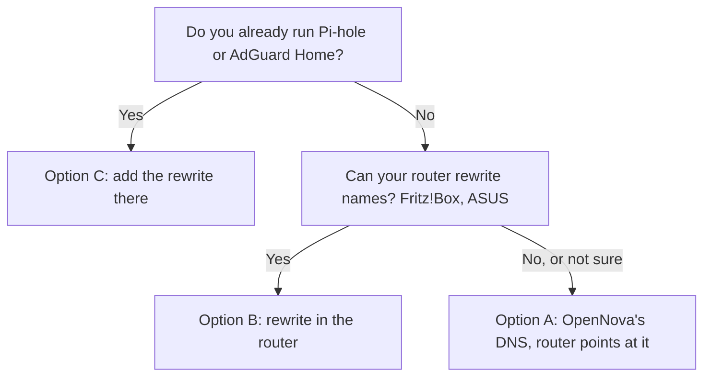

# DNS Setup Guide

!!! info "Who needs this?"
    Everyone who starts. The mower and the charger come with stock firmware
    that always looks up `mqtt.lfibot.com`, whichever app you use, and the
    official Novabot app looks up `app.lfibot.com`. The standard compose
    already runs OpenNova's own DNS (**Option A** below); most people only
    have to point their router at it. Options B and C are for networks that
    already have a router that can rewrite names, or Pi-hole or AdGuard. What
    changes once the mower runs custom firmware is at the
    [end of this page](#after-custom-firmware).

## What is DNS and Why Do I Need It?

The Novabot mower and charger are programmed to connect to `mqtt.lfibot.com` (the Novabot cloud). We need to trick them into connecting to **your local server** instead.

**DNS** is like a phone book for the internet. When your mower looks up `mqtt.lfibot.com`, we want it to find your server's IP address instead of Novabot's cloud server.

```
Without DNS redirect:
  Mower asks: "Where is mqtt.lfibot.com?" → Internet: "47.253.145.99" (Novabot cloud)

With DNS redirect:
  Mower asks: "Where is mqtt.lfibot.com?" → Your DNS: "192.168.0.50" (your server!)
```

## Before You Start

You need to know **two things**:

### 1. Your OpenNova server IP address

This is the IP of the machine running the Docker container. Find it:

=== "Windows"
    Open Command Prompt and type:
    ```
    ipconfig
    ```
    Look for `IPv4 Address` under your WiFi or Ethernet adapter (e.g., `192.168.0.50`).

=== "macOS"
    Open Terminal and type:
    ```
    ipconfig getifaddr en0
    ```
    Or: System Settings → Network → WiFi → Details → IP Address.

=== "Linux"
    ```
    hostname -I | awk '{print $1}'
    ```

=== "Synology NAS"
    Control Panel → Network → Network Interface → Look for the IP.

### 2. Your router's admin page

Usually one of these addresses (type in your browser):

- `http://192.168.0.1`
- `http://192.168.1.1`
- `http://10.0.0.1`

The username/password is often on a sticker on the bottom of your router.

---

## Option A: OpenNova's built-in DNS (default)

The standard compose from [Installing OpenNova](docker.md) already runs a
small DNS server on the OpenNova machine (port 53). It answers `*.lfibot.com`
with `TARGET_IP` and forwards every other name to `UPSTREAM_DNS`. There is
nothing to install; you only tell your router to hand out the OpenNova
machine as the DNS server, so every device on the network asks it first.

```yaml
    ports:
      - "53:53/udp"
    environment:
      ENABLE_DNS: "true"
      UPSTREAM_DNS: "8.8.8.8"          # where everything else goes
```

If you turned this off earlier, put these lines back and `docker compose up -d`.
Port 53 has to be free on the machine; see
[Port 53 is already in use](#port-53-is-already-in-use).

### Set the DNS server in your router

Look for the **DHCP** or **LAN** settings and the field called DNS server.
Enter your OpenNova server IP (`192.168.0.50` in the examples).

=== "Fritz!Box"
    **Home Network → Network → Network Settings → IPv4 settings**: under
    *Local DNS server* enter `192.168.0.50`. **Apply**.

=== "UniFi (UDM / USG)"
    **Settings → Networks → your LAN → DHCP → DNS Server**: set to *Manual*,
    enter `192.168.0.50`. **Apply Changes**.

=== "TP-Link"
    **Advanced → Network → DHCP Server → Primary DNS**: `192.168.0.50`. **Save**.

=== "Netgear"
    **Advanced → Setup → LAN Setup** (or *Internet Setup → DNS Address*):
    *Use these DNS servers*, primary `192.168.0.50`. **Apply**.

=== "ASUS"
    **LAN → DHCP Server → DNS Server 1**: `192.168.0.50`. **Apply**.

=== "Other"
    The field is in the DHCP settings of practically every router. Set only
    the primary DNS: a secondary "backup" DNS is used at random by some
    devices, and those would then still reach the Novabot cloud.

!!! note
    All DNS queries from your network now go through OpenNova. Only
    `*.lfibot.com` is redirected; everything else is forwarded to
    `UPSTREAM_DNS`. Keep this DNS on your LAN: never forward port 53 from the
    internet to it.

Then go to [Restart everything](#restart-everything).

---

## Option B: Your router rewrites the names itself

Some routers can answer a name with an address of your choosing. Then you
do not need OpenNova's DNS: set `ENABLE_DNS: "false"` in the compose and
remove the `"53:53/udp"` line. Only a few routers can do this; if yours is
not below, use Option A.

=== "Fritz!Box"
    1. **Home Network → Network → Network Settings**, scroll to **DNS Rebind
       Protection**, add an exception for `lfibot.com`.
    2. **Internet → DNS Server → Local DNS entries**: add
       `mqtt.lfibot.com` → `192.168.0.50` and `app.lfibot.com` → `192.168.0.50`.
    3. **Apply**.

=== "ASUS"
    **LAN → DNS Director**: add `mqtt.lfibot.com` → `192.168.0.50` and
    `app.lfibot.com` → `192.168.0.50`. **Apply**.

=== "UniFi (UDM, SSH)"
    ```
    ssh root@192.168.1.1
    echo 'address=/lfibot.com/192.168.0.50' > /run/dnsmasq.conf.d/custom.conf
    killall dnsmasq
    ```
    This file is lost on a UniFi firmware update; Option A survives updates.

Then go to [Restart everything](#restart-everything).

---

## Option C: Pi-hole or AdGuard Home you already run

Only for networks that already have one of these. If you do not, do not
install one for OpenNova: Option A does the same thing with nothing extra.
Set `ENABLE_DNS: "false"` in the compose and remove the `"53:53/udp"` line,
so the two do not fight over port 53 when they share a machine.

=== "Pi-hole"
    **Local DNS → DNS Records**: add `mqtt.lfibot.com` → `192.168.0.50` and
    `app.lfibot.com` → `192.168.0.50`, **Add** for each.

=== "AdGuard Home"
    **Filters → DNS Rewrites → Add DNS Rewrite**: `mqtt.lfibot.com` →
    `192.168.0.50` and `app.lfibot.com` → `192.168.0.50`, **Save** for each.

Your router already hands out the Pi-hole or AdGuard address as DNS server;
if not, that is the same DHCP field as in Option A.

Then go to [Restart everything](#restart-everything).

---

## Restart everything

Whatever option you chose, this step is not optional. Every device keeps the
old answer until it asks again, and the mower and charger only ask when they
(re)connect.

1. **Router**: reboot it if you changed its DHCP settings, so the new DNS
   server is handed out.
2. **Mower**: power off, wait ten seconds, power on.
3. **Charging station**: pull the plug, wait ten seconds, plug in. The
   charger has its own Wi-Fi connection and its own MQTT link to the server;
   it is easy to forget.
4. **Phone**: Wi-Fi off and on. On a computer, `ipconfig /flushdns`
   (Windows) or `sudo dscacheutil -flushcache` (macOS).

Then [verify](#how-to-verify), and check the admin panel: both devices should
show as online within a minute. If not, **Why is it not coming online?** on
the device tells you where it stops.

---

## How to Verify

After setting up DNS, test from any device on your network:

=== "Windows"
    ```
    nslookup mqtt.lfibot.com
    ```

=== "macOS / Linux"
    ```
    dig mqtt.lfibot.com +short
    ```

=== "Phone"
    Open a browser and go to: `http://mqtt.lfibot.com`

**Expected result**: Your OpenNova server IP (e.g., `192.168.0.50`).

If you see `47.253.145.99` or a timeout, DNS is not working yet.

---

## Troubleshooting

### "DNS works on my computer but not on the mower"

The mower and charger get their DNS server from the router's DHCP, not from
your computer. Check that you changed the **router's** setting, and that
there is no secondary DNS server next to it. Then
[restart everything](#restart-everything).

### "Port 53 is already in use"

Something else is using port 53 (common on Linux with systemd-resolved):

```bash
# Check what's using port 53
sudo lsof -i :53

# On Ubuntu/Debian: disable systemd-resolved
sudo systemctl stop systemd-resolved
sudo systemctl disable systemd-resolved
```

### "My router doesn't support custom DNS records"

It does not have to: Option A only needs the DHCP DNS-server field, which
every router has.

### "I don't want to change my DNS for the whole network"

Then the mower and charger cannot be redirected: they take their DNS from
DHCP and offer no way to set it by hand. The only way around it is to
provision them with the [OpenNova app](../user-guide/opennova-app.md#provisioning-pointing-a-device-at-your-server),
which writes your server's address into them directly. Your phone can still
use its own DNS (Settings → Wi-Fi → your network → DNS → manual) for the
official app.

---

## Summary: Which Option Should I Choose?


```mermaid
graph TD
    A[Do you already run Pi-hole or AdGuard Home?] -->|Yes| C[Option C: add the rewrite there]
    A -->|No| E[Can your router rewrite names? Fritz!Box, ASUS]
    E -->|Yes| B[Option B: rewrite in the router]
    E -->|No, or not sure| D[Option A: OpenNova's DNS, router points at it]
```

| Option | What you change | Best for |
|--------|-----------------|----------|
| **A: OpenNova's built-in DNS** | One field in your router | Most people; nothing to install |
| **B: Router rewrites** | Two records in the router | Fritz!Box, ASUS |
| **C: Pi-hole / AdGuard** | Two records in the tool you already run | Networks that already have one |

## After custom firmware

A mower on [custom firmware](../firmware/custom-firmware.md) finds the server
by itself through `opennova.local`, and the OpenNova app talks to your
server's IP. Once you are there, the mower no longer needs the DNS redirect.
Two things still do: the **official Novabot app** (`app.lfibot.com`), and the
**charging station** if it was provisioned with the official app, because it
then keeps `mqtt.lfibot.com` as its server. A charger provisioned with the
OpenNova app has your server's IP written into it and does not need DNS.
Leaving Option A on costs nothing, so most people simply keep it.
