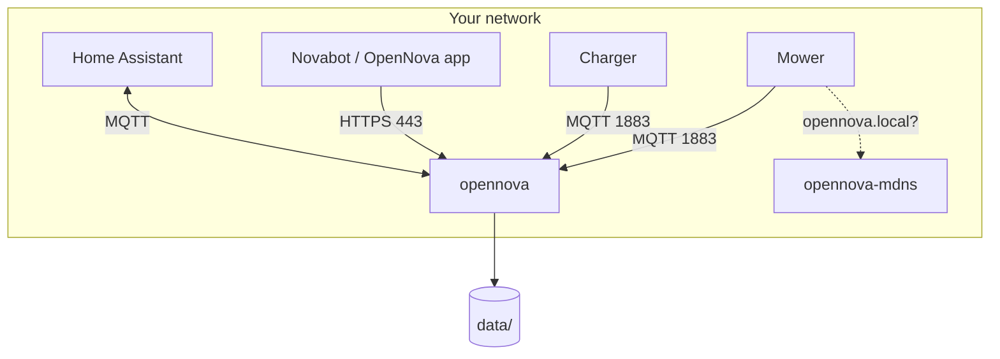

# Installing OpenNova

OpenNova runs as a Docker container and replaces the Novabot cloud on your own
network. This page is the one place for the `docker-compose.yml`: every other
page links here instead of showing its own copy.

## Where will it run?

Pick your situation. It decides everything below.

=== "Linux (recommended)"

    A NAS (Synology, QNAP, ZimaOS, UGREEN), a Raspberry Pi, a Proxmox VM, or
    any Linux box with Docker. **This is the setup that needs nothing extra**:
    the compose below includes a small mDNS helper, so mowers with custom
    firmware find the server by name on their own. Continue with
    [Quick start](#quick-start).

    **No Docker yet?** On Debian, Ubuntu, Raspberry Pi OS and most other
    distributions Docker's own install script does everything (Engine plus
    the `docker compose` plugin):

    ```bash
    sudo apt-get update && sudo apt-get upgrade -y
    curl -fsSL https://get.docker.com -o get-docker.sh && sudo sh get-docker.sh
    sudo usermod -aG docker $USER
    sudo systemctl enable docker
    sudo reboot
    ```

    The `usermod` line matters: without it every `docker` command needs
    `sudo` and the files the container writes end up owned by root. The
    reboot makes the group change take effect. Afterwards check with
    `docker compose version`. On a NAS install "Container
    Manager" (Synology), "Container Station" (QNAP) or the Docker app from
    the NAS's own app store instead; they give you the same `docker
    compose` you need below. Step-by-step for a Pi, including the
    installation itself: [Beginner installation](beginner-installation.md#step-6-install-docker).

=== "macOS (Docker Desktop)"

    Works, with one limitation: Docker Desktop runs containers inside a VM, and
    nothing inside that VM can be discovered by mDNS on your LAN. The compose
    below still works unchanged (the mDNS helper notices the VM and exits
    quietly); your mower reaches the server through the [DNS redirect](dns-setup.md)
    instead, which you need for the stock app anyway. A Mac also has to stay
    on and awake for the mower to keep working.

=== "Windows"

    Not recommended. Docker on Windows has the same VM limitation as macOS,
    plus port and firewall quirks that are hard to support. A Raspberry Pi 4
    or 5 costs less than an afternoon of debugging: see the
    [Raspberry Pi Installer](raspberry-pi-installer.md).

## What it needs (and cheaper boards than a Pi)

The container is small; the numbers below come from the maintainer's own
installs (September 2026).

| | Minimum | Notes |
|---|---|---|
| CPU architecture | **amd64 or arm64** | Those are the only two images. No 32-bit ARM: a Pi 2, a Pi 3 on the 32-bit OS, a Banana Pi M2 and similar boards cannot run it. |
| CPU | anything | 1–2 % of one core in daily use. |
| RAM | **1 GB** without terrain recognition, **2 GB** with | The server idles at about 170 MB and settles around 550 MB after a day. The terrain classifier (the 3D "Terrain" page) loads a ~700 MB model on demand and unloads it 90 s later; on a machine with less than 700 MB free it simply does not load. Set `TERRAIN_CLASSIFY=0` to switch it off entirely. |
| Disk | 16 GB, **64 GB recommended** | Image ~1 GB plus OS and Docker. The recommendation is about SD-card wear, not space. |
| Network | Ethernet preferred | The mower already talks to the server over Wi-Fi; a server on Wi-Fi too stacks two weak links. |

A Raspberry Pi 4 or 5 is the documented path because the
[Raspberry Pi Installer](raspberry-pi-installer.md) prepares its card. If a
Pi is too expensive right now, these run the same image after a manual
Docker install (the commands under **Linux** below):

- **A refurbished thin client or mini PC** (Dell Wyse 5070, HP t630/t640,
  Fujitsu Futro S740, Lenovo Tiny and the like): x86-64, 4–8 GB RAM, a real
  SSD, Ethernet, typically €30–60 second-hand. The best value and the most
  robust option, since there is no SD card to wear out.
- **A second-hand Pi 3B/3B+** on the 64-bit Raspberry Pi OS: 1 GB, so leave
  terrain recognition off. Expected to work, not yet verified by us.
- **Orange Pi Zero 3 (2 GB) and similar arm64 boards** running Armbian or
  Debian: same expectation, same caveat. Stick to boards with a maintained
  Debian image.
- **A Pi Zero 2 W**: 512 MB and Wi-Fi only. Not recommended and not
  supported; if you try it, add swap and set `TERRAIN_CLASSIFY=0`.
- **Whatever you already have**: a NAS with Docker, an old laptop, a Proxmox
  VM.

If you run it on one of the unverified boards, a note in
[GitHub Issues](https://github.com/rvbcrs/Novabot/issues) with the board,
RAM and `docker stats` output turns "expected" into "confirmed" for the
next person.

## Quick start

### 1. Create `docker-compose.yml`

Put this in an empty folder. **Change one line: `TARGET_IP`**, the LAN address
of the machine you are installing on (find it with `ip a` on Linux or in
System Settings → Network on a Mac).

```yaml
--8<-- "docker-compose.yml"
```

!!! note "Port 80 or 443 already in use?"
    Change only the left-hand number, for example `"8080:80"`. Keep `PORT: 80`
    as it is; that is the port *inside* the container. The mDNS helper is not
    affected: it uses no ports but `5353/udp`, and shares that with avahi if
    your host runs it.

This is the same file as [`docker-compose.yml`](https://github.com/rvbcrs/Novabot/blob/master/docker-compose.yml)
in the repository. The optional parts (Home Assistant, push notifications) are
in it, commented out with example values: remove the `#` and fill in your
own.

### 2. Start it

```bash
docker compose up -d
docker compose logs -f --tail 50
```

You should see `HTTP + WebSocket listening on port 80` and `[MQTT] Broker
luistert op port 1883`. On Linux, `docker logs opennova-mdns` shows one line:
`advertising opennova.local -> <your IP> on 5353/udp (host network, detected)`.

### 3. Open the admin panel

Go to **http://TARGET_IP/admin** (or `:8080/admin` if you changed the port).
With an empty database you get the setup page:

- Enter your Novabot cloud credentials to import your account and devices, or
- **Skip cloud import — create local account** (`admin@local`, password `admin`).

### 4. Point the mower at your server

The mower and charger look for `mqtt.lfibot.com` and `app.lfibot.com`. Those
names have to resolve to `TARGET_IP` on your network. Two ways; pick one.

=== "OpenNova's built-in DNS (default)"

    The compose above runs a small DNS server on port 53 that answers
    `*.lfibot.com` with `TARGET_IP` and forwards everything else to
    `UPSTREAM_DNS`. One thing to do: in your router's DHCP settings, set
    `TARGET_IP` as the DNS server, so every device on the network (the mower
    included) asks OpenNova first. Where that field is per router:
    [DNS Setup, Option A](dns-setup.md#option-a-opennovas-built-in-dns-default).

    Port 53 must be free on the host. On Ubuntu and Debian it is usually taken
    by `systemd-resolved`; the [DNS Setup](dns-setup.md#port-53-is-already-in-use)
    page shows how to free it.

    This DNS is meant for your LAN only. Never forward port 53 from the
    internet to it, and on a machine with a public address (a VPS) turn it
    off: it would answer DNS for the whole world.

=== "Your router, Pi-hole or AdGuard"

    If your network already has a place for DNS rewrites, add one for
    `*.lfibot.com` → `TARGET_IP` there (step by step per router and per tool
    on [DNS Setup](dns-setup.md)), and in the compose set `ENABLE_DNS: "false"`
    and remove the `"53:53/udp"` line, so the port stays free for what you
    have.

Then **restart the router** if you changed its DHCP settings, and
**power-cycle both the mower and the charging station** (off, ten seconds,
on). They only ask for the address when they reconnect; without this step
nothing happens. Both should show as online in the admin panel within a
minute.

### 5. Log in with the app

The official Novabot app talks HTTPS to `app.lfibot.com`, which is now your
server with a self-signed certificate. The phone has to trust that
certificate first, on **Android as well as iOS**:

=== "iOS"

    On the iPhone open **http://TARGET_IP/admin** → Settings → Certificate
    setup → **Download iOS profile**, install it under Settings → General →
    VPN & Device Management, then enable it under Settings → General → About
    → Certificate Trust Settings.

=== "Android"

    On the phone open **http://TARGET_IP/admin** → Settings → Certificate
    setup → **Android certificate**, then Settings → Security → Install a
    certificate → **CA certificate**, pick the downloaded file.

Then in the Novabot app: **log out, close the app completely, open it and
log in again** with your normal account. The app still holds a token from the
Novabot cloud; only a fresh login gets one from your server. The first login
creates your local account from the cloud and imports your devices; from then
on the app talks to your server only. The step by step is
on [First Run](getting-started.md).

The [OpenNova app](../user-guide/opennova-app.md) needs none of this: it is
given your server's address and does not use the certificate.

## Checking that it works

The admin panel has **Why is it not coming online?** on every device. It
checks the server (disk, a competing MQTT broker, container network, mDNS),
reachability (DNS, the device's address, Wi-Fi) and the connection itself, and
names the first thing that blocks. Use it before reading any of the sections
below.

## Configuration reference

Everything is set through `environment:` in the compose file.

### Core

| Variable | Default | Description |
|---|---|---|
| `TARGET_IP` | — | **Required.** This machine's LAN IP. Used in firmware download URLs, the TLS certificate and the built-in DNS. |
| `PORT` | `80` | HTTP port inside the container. Change the port mapping, not this. |
| `TZ` | `Europe/Amsterdam` | Timezone. Must match the app, or schedules shift. |
| `ENABLE_TLS` | `false` | HTTPS on 443 with a self-signed certificate. Required by the official app. |
| `ENABLE_DASHBOARD` | `false` | The web dashboard at `/`. |
| `DB_PATH`, `STORAGE_PATH`, `FIRMWARE_PATH` | `/data/...` | Where data lives inside the container. Leave as is. |

### mDNS (mower discovery by name)

| Variable | Default | Description |
|---|---|---|
| `ENABLE_MDNS` | `true` | Advertise `opennova.local` from this container. Set to `false` when `opennova-mdns` runs; inside a bridged container the advertiser only ever hears itself. |
| `MDNS_SIDECAR` | — | `true` tells the diagnosis that `opennova-mdns` does the advertising. |
| `MDNS_ONLY` | — | `true` turns a container into the mDNS helper and nothing else. |
| `MDNS_HOSTNAMES` | `opennova.local,opennovabot.local` | Names to advertise. |

### Built-in DNS

On in the standard compose. Turn it off if you do the rewrite in your router or Pi-hole. See [DNS Setup](dns-setup.md).

| Variable | Default | Description |
|---|---|---|
| `ENABLE_DNS` | `false` (the standard compose sets `true`) | Run dnsmasq that answers `*.lfibot.com` with `TARGET_IP`. Needs `"53:53/udp"` in `ports:`. |
| `UPSTREAM_DNS` | `8.8.8.8` | Where everything else is forwarded. |

### Home Assistant (optional)

| Variable | Default | Description |
|---|---|---|
| `HA_MQTT_HOST` | — | Your HA MQTT broker. Setting this turns the bridge on. |
| `HA_MQTT_PORT` | `1883` | |
| `HA_MQTT_USER`, `HA_MQTT_PASS` | — | Broker credentials. |
| `HA_DISCOVERY_PREFIX` | `homeassistant` | MQTT discovery prefix. |
| `HA_MAP_THROTTLE_MS` | `15000` | Minimum interval between map image republishes. |
| `HA_WEBHOOK_URL` | — | Full event JSON is POSTed here. |
| `RENDER_BASE_URL` | — | Public base URL of this server, so HA can fetch the map image. |

### Notifications (optional)

See [Notifications & Push](notifications.md).

| Variable | Default | Description |
|---|---|---|
| `NTFY_TOPIC` | — | ntfy.sh topic. Setting this turns push on. |
| `NTFY_URL` | `https://ntfy.sh` | |
| `NTFY_PRIORITY` | — | 1 to 5. |
| `LOW_BATTERY_THRESHOLD` | `20` | Battery % for the low-battery event. |

### Other

| Variable | Default | Description |
|---|---|---|
| `OTA_BASE_URL` | `http://TARGET_IP[:PORT]` | Base URL the mower downloads firmware from. Set it when the server sits behind a proxy or a changed port mapping, e.g. `http://192.168.1.50:8080`. |
| `REMOTE_SUPPORT_RELAY_ENABLED` | `false` | Allow the remote support tunnel to be switched on from the admin panel. |
| `LOG_LEVEL` | — | `verbose` logs every request and response. |
| `TERRAIN_CLASSIFY` | `1` | `0` disables terrain recognition (the on-demand ~700 MB SigLIP model). Use it on boards with 1 GB or less. |
| `TERRAIN_MIN_FREE_MB` | `700` | The model is not loaded when the host has less than this much memory available; the batch is skipped and retried next session. |
| `TERRAIN_MODEL_IDLE_MS` | `90000` | How long the model stays in memory after the last classification. `0` = never unload. |
| `TERRAIN_MODEL_THREADS` | `1` | CPU threads the classifier may use. `0` = let onnxruntime decide (it takes every core). |

## Advanced: host networking

`docker-compose.linux.yml` in the repository runs the main container with
`network_mode: host` instead of a bridge. You do not need it for mDNS any more;
`opennova-mdns` covers that. What it still gives you:

- the mower's real IP in the server logs and the device registry (on a bridge
  the server sees docker's gateway instead),
- direct access to the mower's camera stream without a proxy hop.

The price: ports 80, 443 and 1883 must be free on the host, so it rarely fits
on a NAS. Use it on a Raspberry Pi or a dedicated box, and then leave
`opennova-mdns` out; the main container advertises itself.

## Ports and firewall

| Port | Purpose |
|---|---|
| **80/tcp** | HTTP: API, admin panel, dashboard, and the mower's own connectivity check |
| **443/tcp** | HTTPS, only with `ENABLE_TLS=true` |
| **1883/tcp** | MQTT: mower and charger |
| **5353/udp** | mDNS, used by `opennova-mdns` on the host network |
| **53/udp** | Built-in DNS (`ENABLE_DNS=true`, on in the standard compose) |

If you do the rewrite in your router or Pi-hole instead of the built-in DNS,
remove the `"53:53/udp"` line: Docker claims the port even with `ENABLE_DNS`
off, and then collides with `systemd-resolved`, Pi-hole or AdGuard on the same
machine.

The mower's Wi-Fi is **2.4 GHz only**.

## Data

Everything lives in `./data` next to your compose file:

```
data/
  novabot.db      # SQLite: users, devices, maps, schedules
  storage/        # uploaded files: map bundles, overlays
  firmware/       # OTA firmware files
  certs/          # TLS certificate, generated on first start
```

**Backup**: stop nothing, just copy the folder.

```bash
tar czf opennova-backup-$(date +%F).tgz data/
```

**Restore**: stop the container, put the folder back, start it.

```bash
docker compose down
tar xzf opennova-backup-2026-09-18.tgz
docker compose up -d
```

## Upgrading

```bash
docker compose pull
docker compose up -d
docker compose logs -f --tail 50
```

`up -d` recreates only what changed. The database is migrated on start.

## Troubleshooting

Start with **Why is it not coming online?** in the admin panel. Then:

**The container does not start.** `docker compose logs opennova`. The usual
suspects: port 1883 taken by another MQTT broker, port 80 taken by the NAS
itself (change the mapping, see above), port 53 taken by `systemd-resolved`
or another DNS server on the host (free it, see
[DNS Setup](dns-setup.md#port-53-is-already-in-use), or set
`ENABLE_DNS: "false"` and drop the port if that other server does your
rewrite).

**`opennova-mdns` keeps restarting.** `docker logs opennova-mdns`. If it says
the image predates the sidecar, pull again. On Docker Desktop it exits once and
stays stopped; that is intended.

**The mower does not connect.** In this order: does `mqtt.lfibot.com` resolve
to `TARGET_IP` from another device on the LAN; is 1883 reachable
(`nc -zv TARGET_IP 1883`); is the mower on 2.4 GHz; did you power-cycle it after
changing DNS.

**Start over.** `docker compose down`, delete `data/`, `docker compose up -d`.
This removes all users, devices, maps and schedules.

## How it fits together


