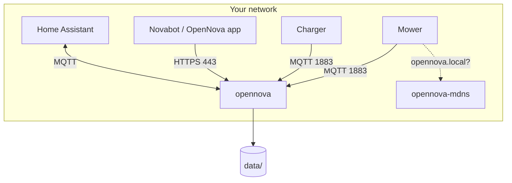

# Installing OpenNova

OpenNova runs as a Docker container and replaces the Novabot cloud on your own
network. This page is the one place for the `docker-compose.yml`: every other
page links here instead of showing its own copy.

## Where will it run?

Pick your situation. It decides everything below.

=== "Linux (recommended)"

    A NAS (Synology, QNAP, ZimaOS, UGREEN), a Raspberry Pi, a Proxmox VM, or
    any Linux box with Docker. **This is the setup that needs nothing extra**:
    the compose below includes a small mDNS helper, so mowers with custom
    firmware find the server by name on their own. Continue with
    [Quick start](#quick-start).

=== "macOS (Docker Desktop)"

    Works, with one limitation: Docker Desktop runs containers inside a VM, and
    nothing inside that VM can be discovered by mDNS on your LAN. The compose
    below still works unchanged (the mDNS helper notices the VM and exits
    quietly); your mower reaches the server through the [DNS redirect](dns-setup.md)
    instead, which you need for the stock app anyway. A Mac also has to stay
    on and awake for the mower to keep working.

=== "Windows"

    Not recommended. Docker on Windows has the same VM limitation as macOS,
    plus port and firewall quirks that are hard to support. A Raspberry Pi 4
    or 5 costs less than an afternoon of debugging: see the
    [Raspberry Pi Installer](raspberry-pi-installer.md).

## Quick start

### 1. Create `docker-compose.yml`

Put this in an empty folder. **Change one line: `TARGET_IP`**, the LAN address
of the machine you are installing on (find it with `ip a` on Linux or in
System Settings → Network on a Mac).

```yaml
--8<-- "docs/.snippets/docker-compose.yml"
```

!!! note "Port 80 or 443 already in use?"
    Change only the left-hand number, for example `"8080:80"`. Keep `PORT: 80`
    as it is; that is the port *inside* the container. The mDNS helper is not
    affected: it uses no ports but `5353/udp`, and shares that with avahi if
    your host runs it.

The full compose in the repository, [`docker-compose.yml`](https://github.com/rvbcrs/Novabot/blob/master/docker-compose.yml),
has every optional setting (Home Assistant, push notifications, remote
support) with comments. Start from the one above; add options from there when
you need them.

### 2. Start it

```bash
docker compose up -d
docker compose logs -f --tail 50
```

You should see `HTTP + WebSocket listening on port 80` and `[MQTT] Broker
luistert op port 1883`. On Linux, `docker logs opennova-mdns` shows one line:
`advertising opennova.local -> <your IP> on 5353/udp (host network, detected)`.

### 3. Open the admin panel

Go to **http://TARGET_IP/admin** (or `:8080/admin` if you changed the port).
With an empty database you get the setup page:

- Enter your Novabot cloud credentials to import your account and devices, or
- **Skip cloud import — create local account** (`admin@local`, password `admin`).

### 4. Point the mower at your server

The mower and charger look for `mqtt.lfibot.com` and `app.lfibot.com`. Those
names have to resolve to `TARGET_IP` on your network. Two ways; pick one.

=== "Your router, Pi-hole or AdGuard"

    Add a DNS rewrite for `*.lfibot.com` → `TARGET_IP` where your network
    already does DNS. Step by step per router and per tool on
    [DNS Setup](dns-setup.md). Nothing changes in the compose.

=== "OpenNova's built-in DNS"

    For when your router cannot do rewrites. Add three lines to the `opennova`
    service and make the router hand out `TARGET_IP` as the DNS server:

    ```yaml
        ports:
          - "53:53/udp"
        environment:
          ENABLE_DNS: "true"
          UPSTREAM_DNS: "8.8.8.8"    # where every other name is forwarded
    ```

    Port 53 must be free on the host. On Ubuntu and Debian it is usually taken
    by `systemd-resolved`; the [DNS Setup](dns-setup.md#port-53-is-already-in-use)
    page shows how to free it.

Then power-cycle the mower so it picks up the new address.

Mowers on [custom firmware](../firmware/custom-firmware.md) also find the
server by name through mDNS, which is what `opennova-mdns` is for. On Linux
that works out of the box; it is a second way in, not a replacement for the
DNS redirect.

### 5. Log in with the app

Open the official Novabot app (or the OpenNova app) and log in with your
normal account. The first login creates your local account from the cloud and
imports your devices; from then on the app talks to your server only.

!!! tip "iOS and the self-signed certificate"
    The iOS Novabot app requires HTTPS. Open **http://TARGET_IP/api/setup/profile**
    on the iPhone to install a profile with the certificate and the DNS
    settings, then trust the certificate under Settings → General → About →
    Certificate Trust Settings.

## Checking that it works

The admin panel has **Why is it not coming online?** on every device. It
checks the server (disk, a competing MQTT broker, container network, mDNS),
reachability (DNS, the device's address, Wi-Fi) and the connection itself, and
names the first thing that blocks. Use it before reading any of the sections
below.

## Configuration reference

Everything is set through `environment:` in the compose file.

### Core

| Variable | Default | Description |
|---|---|---|
| `TARGET_IP` | — | **Required.** This machine's LAN IP. Used in firmware download URLs, the TLS certificate and the built-in DNS. |
| `PORT` | `80` | HTTP port inside the container. Change the port mapping, not this. |
| `TZ` | `Europe/Amsterdam` | Timezone. Must match the app, or schedules shift. |
| `ENABLE_TLS` | `false` | HTTPS on 443 with a self-signed certificate. Required by the official app. |
| `ENABLE_DASHBOARD` | `false` | The web dashboard at `/`. |
| `DB_PATH`, `STORAGE_PATH`, `FIRMWARE_PATH` | `/data/...` | Where data lives inside the container. Leave as is. |

### mDNS (mower discovery by name)

| Variable | Default | Description |
|---|---|---|
| `ENABLE_MDNS` | `true` | Advertise `opennova.local` from this container. Set to `false` when `opennova-mdns` runs; inside a bridged container the advertiser only ever hears itself. |
| `MDNS_SIDECAR` | — | `true` tells the diagnosis that `opennova-mdns` does the advertising. |
| `MDNS_ONLY` | — | `true` turns a container into the mDNS helper and nothing else. |
| `MDNS_HOSTNAMES` | `opennova.local,opennovabot.local` | Names to advertise. |

### Built-in DNS (optional)

Only if you cannot add DNS rewrites on your router or Pi-hole. See [DNS Setup](dns-setup.md).

| Variable | Default | Description |
|---|---|---|
| `ENABLE_DNS` | `false` | Run dnsmasq that answers `*.lfibot.com` with `TARGET_IP`. Needs `"53:53/udp"` in `ports:`. |
| `UPSTREAM_DNS` | `8.8.8.8` | Where everything else is forwarded. |

### Home Assistant (optional)

| Variable | Default | Description |
|---|---|---|
| `HA_MQTT_HOST` | — | Your HA MQTT broker. Setting this turns the bridge on. |
| `HA_MQTT_PORT` | `1883` | |
| `HA_MQTT_USER`, `HA_MQTT_PASS` | — | Broker credentials. |
| `HA_DISCOVERY_PREFIX` | `homeassistant` | MQTT discovery prefix. |
| `HA_MAP_THROTTLE_MS` | `15000` | Minimum interval between map image republishes. |
| `HA_WEBHOOK_URL` | — | Full event JSON is POSTed here. |
| `RENDER_BASE_URL` | — | Public base URL of this server, so HA can fetch the map image. |

### Notifications (optional)

See [Notifications & Push](notifications.md).

| Variable | Default | Description |
|---|---|---|
| `NTFY_TOPIC` | — | ntfy.sh topic. Setting this turns push on. |
| `NTFY_URL` | `https://ntfy.sh` | |
| `NTFY_PRIORITY` | — | 1 to 5. |
| `LOW_BATTERY_THRESHOLD` | `20` | Battery % for the low-battery event. |

### Other

| Variable | Default | Description |
|---|---|---|
| `OTA_BASE_URL` | `http://TARGET_IP[:PORT]` | Base URL the mower downloads firmware from. Set it when the server sits behind a proxy or a changed port mapping, e.g. `http://192.168.1.50:8080`. |
| `REMOTE_SUPPORT_RELAY_ENABLED` | `false` | Allow the remote support tunnel to be switched on from the admin panel. |
| `LOG_LEVEL` | — | `verbose` logs every request and response. |

## Advanced: host networking

`docker-compose.linux.yml` in the repository runs the main container with
`network_mode: host` instead of a bridge. You do not need it for mDNS any more;
`opennova-mdns` covers that. What it still gives you:

- the mower's real IP in the server logs and the device registry (on a bridge
  the server sees docker's gateway instead),
- direct access to the mower's camera stream without a proxy hop.

The price: ports 80, 443 and 1883 must be free on the host, so it rarely fits
on a NAS. Use it on a Raspberry Pi or a dedicated box, and then leave
`opennova-mdns` out; the main container advertises itself.

## Ports and firewall

| Port | Purpose |
|---|---|
| **80/tcp** | HTTP: API, admin panel, dashboard, and the mower's own connectivity check |
| **443/tcp** | HTTPS, only with `ENABLE_TLS=true` |
| **1883/tcp** | MQTT: mower and charger |
| **5353/udp** | mDNS, used by `opennova-mdns` on the host network |
| **53/udp** | Built-in DNS, only with `ENABLE_DNS=true` |

Port 53 is only in your compose if you chose the built-in DNS in step 4. If
you do not use it, leave that line out: Docker claims the port even with
`ENABLE_DNS` off, and then collides with `systemd-resolved`, Pi-hole or AdGuard
on the same machine.

The mower's Wi-Fi is **2.4 GHz only**.

## Data

Everything lives in `./data` next to your compose file:

```
data/
  novabot.db      # SQLite: users, devices, maps, schedules
  storage/        # uploaded files: map bundles, overlays
  firmware/       # OTA firmware files
  certs/          # TLS certificate, generated on first start
```

**Backup**: stop nothing, just copy the folder.

```bash
tar czf opennova-backup-$(date +%F).tgz data/
```

**Restore**: stop the container, put the folder back, start it.

```bash
docker compose down
tar xzf opennova-backup-2026-09-18.tgz
docker compose up -d
```

## Upgrading

```bash
docker compose pull
docker compose up -d
docker compose logs -f --tail 50
```

`up -d` recreates only what changed. The database is migrated on start.

## Troubleshooting

Start with **Why is it not coming online?** in the admin panel. Then:

**The container does not start.** `docker compose logs opennova`. The usual
suspects: port 1883 taken by another MQTT broker, port 80 taken by the NAS
itself (change the mapping, see above), port 53 taken by `systemd-resolved`
(only with `ENABLE_DNS`; stop that service or use your router's DNS instead).

**`opennova-mdns` keeps restarting.** `docker logs opennova-mdns`. If it says
the image predates the sidecar, pull again. On Docker Desktop it exits once and
stays stopped; that is intended.

**The mower does not connect.** In this order: does `mqtt.lfibot.com` resolve
to `TARGET_IP` from another device on the LAN; is 1883 reachable
(`nc -zv TARGET_IP 1883`); is the mower on 2.4 GHz; did you power-cycle it after
changing DNS.

**Start over.** `docker compose down`, delete `data/`, `docker compose up -d`.
This removes all users, devices, maps and schedules.

## How it fits together


