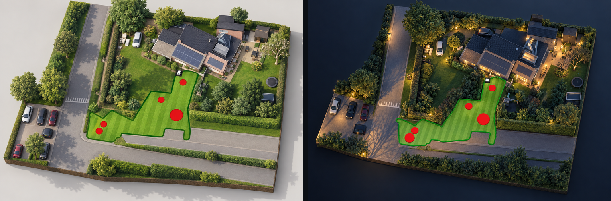

# 3D garden render

OpenNova can turn the mower's own map into a picture of your actual garden: an
isometric 3D visualisation with your house, hedges and trees, and the mowing
zone as a mown striped lawn. It is built from data you already have, and the
mown area in the picture is the area the mower really mows.

## Choosing what the map shows

The map toolbar has a **Base layer** button (dashboard) / a layers icon in the
Map tab (app) with three choices:

| Choice | What you see |
|---|---|
| **Satellite** | The map as it always was: satellite tiles with your zones drawn on them. The default. |
| **Drone photo** | The same map with your uploaded drone photo underneath. Only offered once a photo is uploaded. |
| **3D render** | The generated picture. Day or evening is picked automatically from sunrise and sunset at your mower. |

## How it is made

1. **A base image.** Satellite tiles for the bounding box of your zones, or your
   own drone photo placed by its four corners. In the Netherlands the open PDOK
   aerial imagery (about 8 cm) is used automatically, in the US the USGS one,
   elsewhere Esri's global imagery.
2. **Your geometry painted on it.** Work zones in green with a dark outline,
   obstacles as flat red discs, the dock as a small marker. This step is what
   keeps the render honest: the image model copies these shapes.
3. **One restyle per variant.** An image model turns that composite into a 3D
   render, once for daytime and once for evening.

Steps 1 and 2 run entirely on your server. Step 3 is the only part that leaves
your network.

## What it costs, and what you need

Generating never happens on its own: it only runs when you press the button.
Each run produces two pictures (day and evening).

Under **Settings → 3D render** you provide one of:

- **Your own OpenAI key.** You do not need a ChatGPT subscription; an API
  account with a small prepaid balance is enough. Expect roughly 20 cents per
  picture, so about 40 cents per run.
- **A credit token.** A token from the OpenNova project, for people who would
  rather not create an API account. Your server then posts the composite to the
  project's relay, which spends one credit per picture and forwards the call
  with its own key. Settings shows how many renders the token has left. Tokens
  are handed out by the maintainer (sponsors and donors); see
  [`render-relay/`](https://github.com/rvbcrs/Novabot/tree/master/render-relay)
  if you want to run a relay of your own.

The key is stored on your own server and is never shown again after you save it.
`RENDER_OPENAI_KEY` (or `RENDER_RELAY_TOKEN`) in the environment takes
precedence, if you prefer to keep it out of the database entirely.

!!! warning "Your garden leaves your network"
    A render sends an aerial photo of your property, with your zones painted on
    it, to the image provider. Nothing else is sent, and nothing is sent without
    you pressing the button, but if that is not something you want, do not use
    this feature. The satellite and drone views work without it.

## Notes

- Aerial imagery is a few years old and shot in another season, so recent
  changes to your garden will not be in it. A drone photo is sharper and
  current; upload one and the render uses it.
- The model fills in what it cannot see. Expect garden furniture, a trampoline
  or a shrub that is not really there. Your house, the plot and the mowing zone
  come from the real data.
- Change your map and the render says "the map changed after this render";
  generate again when you want it to match.
